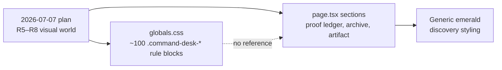

# Command Desk Activation — Requirements

## Summary

Connect the already-written "Boden's command desk" visual layer to the site. The design system exists in `src/app/globals.css` but no component references it, so the homepage runs the desk's information architecture in generic dark-portfolio styling.

## Problem Frame

`docs/plans/2026-07-07-001-feat-personality-grounded-home-hub-plan.md` specifies the command desk in detail: 20 requirements, four actors, four flows, grounded in the Discord, Xfire, KOTOR, and Wizard-manual source families. Its U5 unit is recorded as done in `docs/plans/2026-07-24-001-feat-brain-twin-remainder-plan.md` — the homepage was restored as config-driven React sections (proof ledger, archive boundary, rotating desk artifact).

The visual half never connected. `src/app/globals.css` carries roughly 100 `.command-desk-*` rule blocks (49 distinct selectors) across about 770 lines: HUD grid overlay, CRT green, command amber, beige-paper ink, an absolutely-positioned scene (monitor, keyboard, manual, scoreboard, workbench, sticky, avatar), four hotspot color variants, an active state, and two responsive breakpoints. No `.tsx` or `.ts` file references any of it. The only mention outside that stylesheet is `STRATEGY.md` naming the aesthetic as a goal.

That non-adoption may not have been an oversight. Commit `d63d446` added the desk CSS on 2026-07-24; commit `9100309`, five days later, rebuilt the homepage and wrote generic Tailwind utilities while that CSS already sat in the tree. Whether the U5 pass evaluated the stylesheet and rejected it, or never saw it, is unresolved — planning must determine which before treating reactivation as low-risk.

The same stylesheet also carries a second, equally unreferenced system: roughly 138 `.web-room-*` selectors (lines 285–1363) from the superseded `docs/brainstorms/2026-07-07-personal-web-room-requirements.md` brainstorm, implementing the cozy-cabin aesthetic the parent plan's own AE2 explicitly rejects. Unwired scene CSS in this file has a track record of never shipping.

The shipped sections use generic utilities instead — `border-[#1f1f1f]`, `text-zinc-500`, emerald accents — identical to every other discovery route. The site reads as arbitrary because it has the right structure and none of the personality.

## Key Decisions

- **Reactivate the existing product contract rather than write a new one.** The 2026-07-07 plan's requirements, actors (A1–A4), flows (F1–F4), and acceptance examples (AE1–AE5) remain authoritative. This document covers activation only and does not re-derive product shape.
- **Hotspots ship in the first phase, not a later one.** They are already designed and responsive, and they carry the repeat-visit loop the parent plan calls for in R12. Shipping them requires new focus and positioning CSS, not just wiring — see Dependencies / Assumptions.
- **The first viewport keeps the desk's usefulness metric intact.** The scene ships alongside directly clickable shortcuts, not instead of them, so it cannot silently lower `STRATEGY.md`'s "visits that reach projects/guides/dashboard from `/`" metric.
- **Homepage before site-wide palette.** The scene concentrates both the personality signal and the exploration hooks. Extending desk tokens beyond the homepage is a separate, lower-risk pass — see Scope Boundaries.
- **Field notes are committed to, not deferred.** They add indexable pages that compound search visibility and give the desk something that changes between visits. Guides stay long-form and instructional; notes are short and frequent. They inherit the same private-corpus review gate as curated stories, and degrade gracefully if the writing cadence stalls.
- **Delete the superseded `.web-room-*` system alongside activation.** It is a second orphaned design system in the same file, contradicted by the parent plan's own acceptance criteria, and it ships to every route today.
- **`/about` is untouched.** It keeps portfolio chrome and blue tokens. The dual-chrome model in `README.md` stays intact.
- **Repo hygiene moved to a companion document.** Commit-trailer and file-tracking changes serve no goal this document states; see `docs/brainstorms/2026-07-30-repo-hygiene-requirements.md`.

## Requirements

The three groups below are independently shippable — none blocks the others.

**Homepage command desk**

- R1. The homepage must render inside the `command-desk-shell` treatment so the HUD grid, gradient field, and desk ink palette are visible.
- R2. The first viewport must present the desk scene with its monitor, keyboard, manual, scoreboard, workbench, and avatar elements positioned as the stylesheet specifies.
- R3. The first viewport must also present directly clickable shortcuts to projects, guides, dashboard, and contact. These must not be gated behind hotspot discovery.
- R4. Scene hotspots must be interactive controls that reveal a public-safe artifact card, satisfying the parent plan's F2. Public-safe means synthesized or paraphrased content only — no verbatim quotes, usernames, or IDs from the Discord, Xfire, or AI-chat corpus. One named reviewer must approve each artifact card before it ships.
- R5. Hotspot positions must be expressed without inline `style` attributes, which `eslint.config.mjs` rejects outside OpenGraph image files.
- R6. Hotspot placement must be delivered as new CSS — per-hotspot modifier classes or custom properties consumed by `.command-desk-hotspot` — since the base rule sets no `position` at all.
- R7. Existing homepage sections (proof ledger, archive boundary, desk artifact, desk bot) must adopt desk styling rather than being replaced.
- R8. The mobile layout must follow the stylesheet's existing breakpoints, which hide the scoreboard, manual, sticky note, and hotspot labels below 640px.
- R9. Any content unique to the scoreboard, manual, or sticky note must remain reachable on mobile — duplicated inside a hotspot's artifact card, or exposed through an alternate mobile-visible summary — rather than silently dropped.
- R10. Hotspots must be reachable and operable by keyboard, with an accessible name that does not depend on the visually hidden label.
- R11. Activating a hotspot must move focus into its artifact card or close control. Closing the card must return focus to the originating hotspot.
- R12. Each artifact card must have an explicit close control and support Escape-key dismissal. Activating a different hotspot while a card is open must replace it, not stack.

**Discovery hub consistency**

- R13. The GitHub Pages static export must continue to build. `.github/workflows/deploy-pages.yml` removes `src/app/api` before the build runs when `DEPLOY_TARGET=github-pages` is set; the export itself must not depend on server-only routes.

**Field notes**

- R14. A field-notes surface must exist for short posts, separate from Guides, which stay long-form and instructional.
- R15. Each note must be an indexable page with its own title, date, and description metadata.
- R16. Notes must be authored as markdown files alongside the existing guides content, so publishing needs no database. If notes live outside `src/content/guides/`, their directory must be added to `outputFileTracingIncludes` in `next.config.ts`, or the standalone build will omit them.
- R17. The homepage must surface recent notes, giving the desk a reason to change between visits.
- R18. Field notes must not reference or be derived from the private corpus (Discord, Xfire, AI-chat exports) unless routed through the same review-and-approval gate defined for curated personal stories.
- R19. The homepage notes area must degrade to a resting state once the newest note exceeds a configured age threshold, so a stalled cadence never renders as a stale feed.

## Acceptance Examples

- AE1. **Covers R4, R10.** Given a visitor reaches a hotspot by keyboard alone, when they activate it, then the artifact card opens and its content is announced without relying on the label hidden at mobile widths.
- AE2. **Covers R8.** Given a 375px-wide viewport, when the homepage loads, then the scene renders without horizontal overflow and the hidden elements stay hidden.
- AE3. **Covers R7.** Given the proof ledger section, when desk styling is applied, then its content and configuration keys are unchanged.
- AE4. **Covers R13.** Given `src/app/api` removed and `DEPLOY_TARGET=github-pages` set, matching the deploy workflow, when the build runs, then it exits zero and the homepage renders without server-only APIs.
- AE5. **Covers R14, R17.** Given no notes have been written yet, when the homepage renders, then the notes area is hidden or shows a resting state rather than an empty shell.
- AE6. **Covers R3.** Given the homepage loads, when a visitor looks at the first viewport, then projects, guides, dashboard, and contact are each reachable in one click without hovering or activating a hotspot.
- AE7. **Covers R11, R12.** Given a keyboard user activates a hotspot, when the artifact card opens, then focus moves into it; when the user presses Escape or activates the close control, then focus returns to the originating hotspot; when a different hotspot is activated while a card is open, then the open card is replaced, not stacked.
- AE8. **Covers R19.** Given the newest note is older than the configured threshold, when the homepage renders, then the notes area shows the resting state rather than a dated entry.

## Scope Boundaries

### Deferred for later

- Extending desk tokens to `/projects`, `/guides`, `/dashboard`, `/contact`, `/search`, and the 404 route — a separate pass after the homepage lands.
- Curated personal stories drawn from the private corpus, each reviewed and approved individually before publication.
- Analytics-driven tuning of which repeat-visit loops actually work, matching the parent plan's deferral.

### Outside this product's identity

- Any change to `/about`.
- Reviving PR #4 (`feat/cyberscape-hold`), which stays parked.
- Publishing raw Discord, Xfire, or AI-chat material in any form.
- Rewriting published git history.
- A database or authentication layer.

## Dependencies / Assumptions

- A1. The stylesheet has three real gaps, not one. It defines hotspot color variants and an active state but no positioning mechanism (`.command-desk-hotspot` sets no `position` at all, unlike every other scene child). It defines zero `:focus`/`:focus-visible` styling for any interactive element, while the superseded `.web-room-*` block has two. And `.command-desk-shell` has never appeared in any `.tsx` or `.html` file in repo history, so it has never been rendered against real markup.
- A2. A throwaway markup spike rendering the full scene at 1440px, 900px, and 375px must happen before R1, R2, R7, or R10 depend on the stylesheet being usable as written.
- A3. Public material — the `u/th3w1zard1` Reddit history, Deadly Stream forum posts, and GitHub activity — can be used without the private-corpus review gate, because it is already public.

## Outstanding Questions

### Deferred to planning

- Q1. Which hotspots anchor the first release, and what artifact does each reveal? The parent plan's Q4 asked for five and never answered.
- Q2. When the deferred token-extension pass starts, how far does it go on secondary routes — full scene treatment, or palette and typography only?
- Q3. Do field notes reuse the guides pipeline in `src/lib/guides.ts` or get their own loader? Both read markdown with frontmatter, but notes need different sorting and no difficulty rating.
- Q4. Does `command-desk-shell` attach inside `PageLayout`'s `<main>`, or does the homepage bypass `PageLayout` for its own shell? `PageLayout` currently hardcodes `bg-[#0a0a0a] text-white` and accepts only `children`, and the shell declares `min-height: 100vh`, `overflow: hidden`, and a fixed full-viewport HUD overlay.
- Q5. Does the homepage adopt the existing `.command-desk-*` class vocabulary wholesale, or port only the `--desk-*` tokens and scene block into the current Tailwind/config-driven section system? The stylesheet has never been rendered, so wholesale adoption carries unmeasured risk.

## Sources / Research

- `docs/plans/2026-07-07-001-feat-personality-grounded-home-hub-plan.md` — the authoritative product contract, including R1–R20, A1–A4, F1–F4, AE1–AE5.
- `docs/plans/2026-07-24-001-feat-brain-twin-remainder-plan.md` — U5 and U6 status; records the homepage as restored while the visual layer stayed unwired.
- `src/app/globals.css` lines 2078–2849 — the unreferenced `.command-desk-*` system, including the responsive blocks. Lines 285–1363 carry the second, superseded `.web-room-*` system.
- `eslint.config.mjs` lines 31–38 — the inline-style restriction that shapes R5.
- `.github/workflows/deploy-pages.yml` line 34 — where `src/app/api` is actually removed for the GitHub Pages export (not `next.config.ts`, as an earlier draft of this document claimed).
- `next.config.ts` — `outputFileTracingIncludes` pins standalone-build markdown tracing to `src/content/guides/**/*.md` and `guides/**/*.md`, relevant to R16.
- `STRATEGY.md` — names the command-desk aesthetic as the approach and the desk-usefulness metric R3 protects; its "Not working on" list rules out publishing the private corpus.
- `docs/brainstorms/2026-07-07-personal-web-room-requirements.md` — superseded by the 2026-07-07 plan; source of the orphaned `.web-room-*` CSS.
