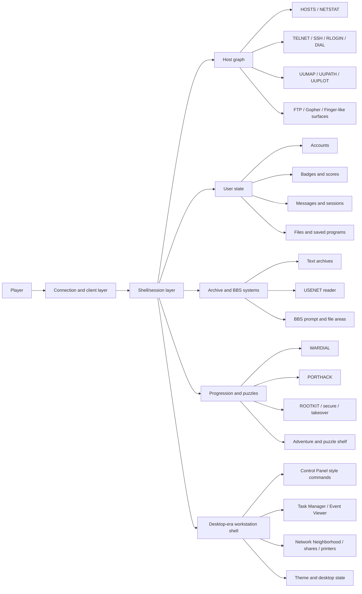

# Cyberscape Network Reference

This is the canonical reference for the Cyberscape effort. The shorter knowledgebase files in `00-intent`, `20-domain-theory`, `30-product-ux`, and `90-meta` are derivatives of this document. The feature-by-feature parity backlog lives in `docs/knowledgebase/50-execution/cyberscape-feature-parity-roadmap.md`.

## Evidence labels

| Label | Meaning | Examples |
| --- | --- | --- |
| `[OFFICIAL]` | Primary historical-network source or official project surface. | `https://telehack.com/telehack.html`, `https://telehack.com/basic.html`, `https://telehack.com/privacy.html`, `https://github.com/telehack-foundation`. |
| `[OPEN]` | Community, mirrored, or unverified public material. Useful, but not authoritative alone. | Telewiki, `telehack-utils`, JKirchartz BBS notes, host-map repos. |
| `[SYNTH]` | Cyberscape design interpretation or reconstruction choice. | Data model, replay strategy, behavioral parity boundaries. |
| `[IMPLEMENTED]` | Current repo behavior evidenced by local code, data, or tests. | `packages/cyberscape/src/lib/shell/commands.ts`, `packages/cyberscape/tests/acceptance.test.ts`. |

## Executive summary

[OFFICIAL] The historical network reference is an online multi-user simulation of a stylized ARPANET, UUCP, Usenet, dial-up, and BBS-era computing world, roughly centered on 1985-1990 culture. The official manual describes web, telnet, rlogin, SSH, FTP, Gopher, Finger, QOTD, Usenet, interactive fiction, period BASIC, historical hosts, and a host-hacking loop. The public foundation surface describes the project as created by `forbin`, begun in 2010, actively maintained, and containing more than 26,600 hosts and more than 50,000 users.

[SYNTH] The important product reading is that the reference is not one narrow game. It is three overlapping systems:

1. A digital museum built from historical hosts, textfiles, Usenet material, BBS culture, old tools, and old terminal expectations.
2. A social command-line world where users have persistent identities, profiles, messages, sessions, plans, privileges, and public state.
3. A progression and puzzle environment where adjacency, porthacking, wardialing, files, rootkits, badges, hidden systems, and minigames turn the museum into a durable game.

[SYNTH] Cyberscape is the product name. It exists to preserve that combined shape in a standalone web game without making terminal or telnet the only first-class interface. The aim is not a portfolio easter egg and not a cosmetic terminal. The aim is a serious behavioral recreation: a live shell, persistent users, a host graph, file systems, BBS and archive surfaces, progression loops, Windows-era workstation affordances, and a source-bounded route toward deeper historical-network systems.

[IMPLEMENTED] The current repo already contains more than the older docs admitted: a Next.js package at `packages/cyberscape`, a large shell command registry, badge gates, pager behavior, a shell stack, BBS, USENET and adventure runners, desktop-era command surfaces, SQLite-backed persistence, host data import, archive assignments, and broad acceptance coverage in `packages/cyberscape/tests/acceptance.test.ts`.

[SYNTH] The documentation standard for this project is: never confuse reference facts, community lore, and Cyberscape implementation. Each strong claim needs an evidence label or an explicit limitation.

## Scope and source basis

### Primary sources

[OFFICIAL] The strongest public sources for the historical network reference are:

| Source | Use in Cyberscape docs |
| --- | --- |
| `https://telehack.com/telehack.html` | Shell UX, access methods, command syntax, pager behavior, host traversal, examples. |
| `https://telehack.com/basic.html` | period BASIC syntax and APIs, especially functions that expose game state. |
| `https://telehack.com/privacy.html` | Logging, visibility, privacy, and social persistence expectations. |
| `https://github.com/telehack-foundation` | Stewardship and public project identity. |
| Andy Baio interview with `forbin` | Creator intent, historical archive philosophy, implementation history, hidden-content design. |

[IMPLEMENTED] Local source captures currently available in this repo:

| Local artifact | Role |
| --- | --- |
| `data/raw/classic-network-manual.html.txt` | Captured official manual text. |
| `data/raw/np43-host-list.txt` | Open host-list seed used by the import pipeline. |
| `data/raw/jkirchartz-bbs-research.txt` | Community BBS mapping notes. |
| `data/raw/telehack-utils-readme.md` | Open tooling reference. |
| `data/archive-manifest.json` | Curated archive manifest used for assignment and review. |

### Limits that matter

[OFFICIAL] The public GitHub organization for the reference service does not expose the live server source, full command table, full host graph, or hidden puzzle catalog. Public docs and official pages explain enough to reconstruct a lot, but not enough to claim transcript-level completeness.

[OFFICIAL] The older official manual is authoritative for documented behavior, but it is not a complete description of the live 2026 service. Current public user pages, period BASIC references, and community docs show systems beyond the old manual.

[SYNTH] Cyberscape should therefore be judged as a behavioral reconstruction, not as a byte-identical clone. The correct standard is: source-bounded mechanics, convincing system feel, persistent loops, and explicit gaps.

### Feature parity conversion

[SYNTH] "Full feature parity" in this project means Cyberscape should account for every major public reference capability in a way that makes sense for Cyberscape's own product context. It does not mean copying hidden server internals, publishing spoiler dumps, or pretending that unavailable live data is known.

Use `docs/knowledgebase/50-execution/cyberscape-feature-parity-roadmap.md` as the operational parity backlog. Each item should resolve to one of three outcomes:

1. Implement the capability directly because it is public, source-backed, and fits Cyberscape.
2. Implement a Cyberscape-native equivalent because the role matters more than the literal surface.
3. Mark it as research, deferred, or intentionally not cloned, with a concrete reason.

## System model

[SYNTH] The reference service's original fantasy is "safe hacking in a historical computer world." Cyberscape keeps that fantasy but also adds a Windows NT/2000/XP/7-flavored workstation shell as a native presentation and interaction layer. That addition is not reference-authentic by itself; it is a Cyberscape lens for exposing the same underlying host, session, user, file, and network state through familiar desktop-era metaphors.

## Architecture, access, services, and hosts

### Reference Access Model

[OFFICIAL] The reference service is externally reachable through browser, telnet, rlogin, SSH, dial-up modem, FTP, Gopher, Finger, and QOTD surfaces. The official manual documents `telnet telehack.com`, `rlogin guest@telehack.com`, `ssh -p 2222 guest@telehack.com`, telnet alternatives on ports `1337`, `8080`, and `31173`, QOTD on port `17`, FTP on port `21`, Gopher on port `70`, and Finger on port `79`.

[SYNTH] Those surfaces imply that a faithful recreation eventually needs to separate three concerns:

| Concern | Reference evidence | Cyberscape interpretation |
| --- | --- | --- |
| Transport | Web, telnet, rlogin, SSH, modem, FTP, Gopher, Finger, QOTD. | Web shell first; wire protocols can come later if the game state is already solid. |
| Session | Prompt, current host, login identity, remote stack, subsystem mode. | Server-owned shell state with prompt modes and persisted user data. |
| World | Hosts, neighbors, historical users, files, services, tools. | Imported/generative host graph plus curated hero hosts and archive assignments. |

[IMPLEMENTED] Cyberscape currently exposes the game through a Next.js web app and API routes under `packages/cyberscape/src/app`. The package has `POST /api/shell`, a plain terminal route, and a server-side shell engine. Real telnet/SSH daemon behavior is not implemented.

[IMPLEMENTED] Cyberscape now treats pre-LAN connection as an executable game action, not only a themed label. `coupler <host|number>` attaches an acoustic coupler at 110 or 300 baud before a low-speed call, `phonebook add/rm` persists a personal `phonebook.txt` in user files, `dialup` exposes deterministic phone numbers for visible/saved/personal hosts, `wardial` reports carrier previews, `modems` and `lineage` surface the same backend rows through Windows-era applets, and `dial <number|host>` resolves those rows into acoustic-coupler connects, modem connects, busy, no-carrier, or toll-blocked outcomes. `operator <host|number>` opens a session-scoped long-distance circuit for multi-hop routes before dialing, records a bounded calling-card toll ledger, and exposes that ledger through `accounts`, `credentials`, and `modems` rows without displaying secret material. Dialing a BBS includes a modem handoff before the board login ritual. This is still an in-world simulation; it does not claim a real public phone endpoint.

### Host graph

[OFFICIAL] The reference host model is graph-based, not a flat global list. The official manual says users can `TELNET` only to hosts visible from the current `NETSTAT` view. In manual examples, symbols such as `*` and `!` indicate login and root privileges.

[OFFICIAL] Public primary sources state that the reference contains more than 26,600 virtual hosts representing real systems from modem, Fidonet, UUCP/Usenet, and ARPANET-era networks. The full live list is not published as a primary source.

[OPEN] The `np43` host list provides a useful seed with thousands of host rows, but it is not the complete live reference graph.

[IMPLEMENTED] Cyberscape imports host data from `data/raw/np43-host-list.txt` through `packages/cyberscape/scripts/import-hosts.ts` into `packages/cyberscape/src/data/hosts.json`. `packages/cyberscape/src/lib/net/hero-hosts.ts` injects curated hero systems. `packages/cyberscape/src/lib/net/hosts.ts` exposes host lookup, counts, routes, `netstat`, `uupath`, and `uumap`.

### Representative host semantics

| Concept | Reference basis | Cyberscape handling |
| --- | --- | --- |
| Current host | `[OFFICIAL]` Prompt and command behavior change with remote stack. | `[IMPLEMENTED]` `currentHost` and `prompt` live in shell state. |
| Neighbor reachability | `[OFFICIAL]` `NETSTAT` determines reachable hosts. | `[IMPLEMENTED]` `uupath`, `uumap`, porthack adjacency, and transport verbs use host graph functions. |
| Login privilege | `[OFFICIAL]` Hacked hosts can be logged into with user's credentials. | `[IMPLEMENTED]` porthack records login-like access and scores/owned output reflect it. |
| Root privilege | `[OFFICIAL]/[OPEN]` Root is a higher persistent privilege, often involving rootkit/support kit mechanics. | `[IMPLEMENTED]` rootkit/secure/takeover can seize root and tests cover root ownership. |
| BBS host | `[OFFICIAL]/[OPEN]` BBSes and BBS lists are part of the world. | `[IMPLEMENTED]` BBS prompt, file areas, messages, and archive assignments exist. |

## Shell, commands, and UX

### Prompts and shell modes

[OFFICIAL] The reference is case-insensitive, uses `<>` for required arguments and `[]` for optional arguments, and presents a `.` prompt before login. The manual documents `^C`, `^D`, `EXIT`, `QUIT`, and tab completion expectations.

[IMPLEMENTED] Cyberscape uses prompt state in `packages/cyberscape/src/lib/shell/types.ts` and a server-owned shell engine in `packages/cyberscape/src/lib/shell/engine.ts`. Acceptance tests cover the NLI dot prompt, login flow, BBS prompt entry/exit, monitor entry/exit, nested adventure runners, and shell-stack transport.

| Mode | Prompt / surface | Status |
| --- | --- | --- |
| NLI lobby | `.` style pre-login shell | `[IMPLEMENTED]` Tested. |
| Logged-in local shell | `@`-style account shell | `[IMPLEMENTED]` Tested through login/newuser and persistence. |
| Remote host | Host stack after transport commands | `[IMPLEMENTED]` Tested for telnet/ssh/rlogin-style verbs. |
| BBS | `-` prompt/menu subsystem | `[IMPLEMENTED]` Tested for reading, posting, files, and exit. |
| Monitor | `CALL -151` low-level monitor | `[IMPLEMENTED]` Tested for entry/exit. |
| Adventure/Z-code | Nested game runner | `[IMPLEMENTED]` Tested for Zork/adventure flows. |

### Command families

[OFFICIAL] The reference manual's NLI list includes utilities, games, archive readers, protocol verbs, and system curiosities such as `2048`, `a2`, `advent`, `aquarium`, `basic`, `bf`, `c8`, `cal`, `calc`, `ching`, `clear`, `clock`, `cowsay`, `date`, `ddate`, `echo`, `eliza`, `factor`, `figlet`, `finger`, `fnord`, `geoip`, `help`, `ipaddr`, `joke`, `login`, `mac`, `md5`, `morse`, `newuser`, `notes`, `octopus`, `phoon`, `pig`, `ping`, `pong`, `primes`, `privacy`, `qr`, `rain`, `rand`, `rfc`, `rig`, `roll`, `rot13`, `sleep`, `starwars`, `traceroute`, `typespeed`, `units`, `uptime`, `usenet`, `users`, `uumap`, `uupath`, `uuplot`, `weather`, `when`, `zc`, `zork`, and `zrun`.

[IMPLEMENTED] Cyberscape's command registry is larger than the old docs describe. `packages/cyberscape/src/lib/shell/commands.ts` defines NLI commands, logged-in commands, command help, and badge gates. The registry includes official-like shell and retro commands plus Cyberscape-specific desktop/workstation commands.

| Family | Examples | Evidence |
| --- | --- | --- |
| Login and identity | `login`, `newuser`, `who`, `users`, `finger`, `whoami`, `status`, `scores` | `[IMPLEMENTED]` Command registry and acceptance tests. |
| Network traversal | `hosts`, `netstat`, `telnet`, `ssh`, `rlogin`, `uupath`, `uumap`, `uuplot`, `trace`, `traceroute`, `back` | `[OFFICIAL]` reference manual; `[IMPLEMENTED]` graph and shell tests. |
| Archive/protocol surfaces | `ftp`, `gopher`, `usenet`, `news`, `mail`, `notes`, `qotd`, `rfc` | `[OFFICIAL]` access model; `[IMPLEMENTED]` FTP/Gopher/mail/USENET tests. |
| Filesystem | `ls`, `dir`, `cat`, `cd`, `pwd`, `write`, `append`, `rm`, `cp`, `mv`, `grep`, `find` | `[IMPLEMENTED]` shell engine and persistence tests. |
| Progression | `wardial`, `porthack`, `rootkit`, `secure`, `takeover`, `owned`, `scan`, `inspect`, `solve` | `[OPEN]/[SYNTH]` mechanics; `[IMPLEMENTED]` tests for core loops. |
| Social/session | `send`, `inbox`, `link`, `unlink`, `camp`, `tunnel`, `ps`, `kill` | `[OFFICIAL]/[OPEN]` social/session concepts; `[IMPLEMENTED]` session tests. |
| BBS/games | `bbs`, `games`, `run`, `zork`, `advent`, `zc`, `zrun`, `zcode`, `basic`, `call` | `[OFFICIAL]` BBS/IF/BASIC/monitor concepts; `[IMPLEMENTED]` subsystem tests. |
| Retro utilities | `clock`, `ddate`, `weather`, `when`, `rand`, `roll`, `rot13`, `md5`, `ipaddr`, `mac`, `calc`, `factor`, `primes`, `morse`, `cowsay`, `figlet`, `2048`, `aquarium`, `rain`, `starwars`, `eliza`, `phoon`, `pig`, `fnord`, `qr`, `a2`, `ac`, `bf`, `c8`, `cal`, `ching`, `geoip`, `octopus`, `rig`, `sleep`, `typespeed` | `[OFFICIAL]` command-list inspiration; `[IMPLEMENTED]` command registry/tests. |
| Windows-era workstation | `desktop`, `theme`, `taskmgr`, `scheduler`, `events`, `eventviewer`, `search`, `connections`, `netsetup`, `netdiag`, `files`, `mailbox`, `boards`, `system`, `winver`, `control`, `accounts`, `datetime`, `display`, `sounds`, `power`, `mouse`, `keyboard`, `accessibility`, `regional`, `modems`, `odbc`, `programs`, `internet`, `firewall`, `updates`, `performance`, `restore`, `computer`, `disk`, `network`, `dialup`, `devices`, `nodes`, `security`, `services`, `shares`, `printers`, `registry` | `[SYNTH]/[IMPLEMENTED]` Cyberscape-specific shell layer. |

### Pager and pipes

[OFFICIAL] The reference pager is a first-class interaction surface. The manual documents `--More--` controls including space, `b`, `q`, `g`, `G`, return, `j`, `k`, `/`, `?`, `n`, and `N`. It also documents pipeline-style transforms such as `head`, `tail`, `grep`, `sort`, `wc`, and `cut` on paginated output.

[IMPLEMENTED] Cyberscape has a pager module in `packages/cyberscape/src/lib/shell/pager.ts`. Acceptance tests cover paging through `hosts`, back/top/bottom/line movement, search, quit, browser API passthrough, and shell pipes filtering paginated output.

### STTY and accessibility

[OFFICIAL] The reference documents `STTY /dumb` for plain output and `STTY /tty` for teletype-style output.

[IMPLEMENTED] Cyberscape has output shaping in `packages/cyberscape/src/lib/shell/stty.ts`; tests cover dumb-mode stripping and API output shaping. The docs should treat accessibility as part of authenticity, not an optional afterthought.

## Filesystem, archives, and executable tooling

[OFFICIAL] The reference has host-local files, executable tools, BASIC programs, adventure files, and user-writable storage. The manual warns about disk usage and file transfer. The period BASIC reference exposes `DIR$` and file operations.

[OPEN] Community references describe executable progression tools such as `wardial.exe`, `porthack.exe`, `rootkit.exe`, OS support kits, `pppd.exe`, `killproc.exe`, monitoring tools, and hidden utilities.

[IMPLEMENTED] Cyberscape implements a file surface through shell state, host files, user home files, FTP retrieval, BBS file areas, archive assignments, and persistence tests. It does not need to mimic every exact `.exe` implementation before the world model is coherent.

| Tool or file concept | Reference role | Cyberscape status |
| --- | --- | --- |
| `porthack.exe` / porthack | Gain login access on adjacent hosts. | `[IMPLEMENTED]` `porthack` command rejects non-adjacent hosts and records access. |
| `wardial.exe` / wardial | Discover adjacent/dial-up systems. | `[IMPLEMENTED]` `wardial` command reports numbers, speeds, carrier previews, and unlocks the badge gate. |
| `rootkit.exe` / rootkit | Escalate to root with correct conditions. | `[IMPLEMENTED]` `rootkit`, `secure`, and `takeover` root flows exist, with payload/root tests. |
| BBS file libraries | Browse and download period files. | `[IMPLEMENTED]` BBS file areas and archive assignments exist. |
| User files | Writable persistent user storage. | `[IMPLEMENTED]` write/append/copy/move/remove and downloaded files persist. |
| period BASIC programs | Scriptable subsystem and historical BASIC library. | `[IMPLEMENTED]` A BASIC interpreter surface supports catalog/load/run/save/delete/quit in tests; full period BASIC API parity remains open. |

## period BASIC and programmable world state

[OFFICIAL] period BASIC is a major reference subsystem, not just a novelty command. It extends Dartmouth BASIC and exposes game state through functions such as `TH_SYSLEVEL`, `TH_LOGINS`, `TH_ROOTS`, `TH_SYSOPS`, `TH_ADMINS`, `TH_HASLOGIN`, `TH_HASROOT`, `TH_HASSYSOP`, `TH_HASADMIN`, `TH_PLAN$`, `TH_DEFGROUP$`, `TH_TIME`, `TH_HOSTNAME$`, and `TH_NETSTAT$`.

[SYNTH] The design lesson is bigger than BASIC syntax: the reference lets the world inspect itself. A faithful Cyberscape route should eventually expose enough state for players to script, audit, and reason about their network.

[IMPLEMENTED] Cyberscape currently includes a `basic` command surface with persistence tests for user programs. It should not claim full period BASIC parity until the state-inspection APIs are deliberately implemented and tested.

## Progression, persistence, and multiplayer

### Progression

[OFFICIAL] Reference progression is persistent and badge-driven. Public user pages and period BASIC APIs expose badges, system level, login counts, roots, sysops, admins, quests, dojo progress, race stats, commands executed, and account age.

[OPEN] Community materials add details about porthack adjacency, rootkit support kits, BBS/sysop paths, satellite/admin privileges, races, Telefrag, and hidden mechanics.

[IMPLEMENTED] Cyberscape has starter badges, badge-derived disk quota/system level, badge gates, porthack, rootkit, ownership display, scores, downloaded-file scoring, durable account state, and persistence across API sessions.

| Progression layer | Source status | Cyberscape status |
| --- | --- | --- |
| Account creation/login | `[OFFICIAL]` `NEWUSER` and `LOGIN`. | `[IMPLEMENTED]` New user, login, logout, persistence tests. |
| Badges/system level | `[OFFICIAL]` period BASIC/user pages expose badge-based state. | `[IMPLEMENTED]` Badge gates and scores exist. |
| Host login ownership | `[OFFICIAL]` `*` marker and porthack examples. | `[IMPLEMENTED]` Porthack records access and owned systems report it. |
| Root ownership | `[OFFICIAL]/[OPEN]` `!` marker and rootkit/support-kit mechanics. | `[IMPLEMENTED]` Rootkit/secure/takeover seize root; exact support-kit parity remains open. |
| BBS/sysop | `[OPEN]` Community docs and BBS list behavior. | `[IMPLEMENTED]` BBS use and first persisted sysop claim exist; full sysop economy remains open. |
| Satellite/admin | `[OFFICIAL]/[OPEN]` Public user pages and period BASIC expose admin counts. | `[OPEN]` Not claimed as implemented. |
| Dojo/races/Telefrag | `[OFFICIAL]/[OPEN]` Visible on public/user/community surfaces. | `[OPEN]` Not claimed as implemented unless later code proves it. |

### Social and session world

[OFFICIAL] The reference includes social features such as `SEND`, `RELAY`, `TALK`, `FINGER`, user profiles, notes/news, and session visibility. Its privacy policy says user activity, chat/mail data, process/file names, and status information can be logged or visible to other users.

[IMPLEMENTED] Cyberscape implements users, `who`, `finger`, mail, inbox, durable messages, BBS posts, link mirroring, persisted shell sessions, camp/tunnel state, process rows, and killable local shell route jobs. This is a meaningful start toward the social world rather than just single-player command emulation.

## History, hidden content, and reliability stance

[OFFICIAL] Creator interviews describe the reference as a safe place to experience historical hacking aesthetics and old network culture. The historical archive side is central: period files, rescued Usenet material, historical users, and old command environments are part of the point.

[OFFICIAL]/[OPEN] Hidden hosts, monitor entries, `PTYCON`, and secret discovery are not accidental; they are part of the reference's exploratory design. Community spoiler norms reinforce that the live world is still puzzle-rich.

[SYNTH] Cyberscape should preserve the principle without faking mystery through vague docs. The docs should name which layers exist, which are planned, and which remain intentionally unexplored.

[SYNTH] Intended in-game exploits are not real-world vulnerability claims. Porthack, wardialing, rootkit, monitor entry, and hidden tools are game mechanics. Public docs should avoid teaching or implying unauthorized real-world access.

[IMPLEMENTED] Cyberscape's current risk boundary is local app/data risk and archive licensing/provenance, not real telnet/SSH exposure. See `docs/knowledgebase/40-operational-risk/bbs-archive-licensing.md` for archive handling.

## Current implementation status

| Area | Current evidence | Status |
| --- | --- | --- |
| Package | `packages/cyberscape/package.json` | `[IMPLEMENTED]` Standalone Next.js package with dev/build/start/lint/test/import/db scripts. |
| Shell registry | `packages/cyberscape/src/lib/shell/commands.ts` | `[IMPLEMENTED]` Large NLI/logged-in command registry, help map, badge gates. |
| Shell engine | `packages/cyberscape/src/lib/shell/engine.ts` | `[IMPLEMENTED]` Server-owned command execution, subsystem handling, desktop state, social/session mechanics. |
| Persistence | `packages/cyberscape/src/lib/db`, acceptance tests | `[IMPLEMENTED]` Users, badges, mail, programs, checkpoints, files, theme/window state persist across API sessions. |
| Pager/pipes | `packages/cyberscape/src/lib/shell/pager.ts`, tests | `[IMPLEMENTED]` Pager and pipe behavior covered. |
| STTY | `packages/cyberscape/src/lib/shell/stty.ts`, tests | `[IMPLEMENTED]` Dumb/TTY shaping covered. |
| Host graph | `packages/cyberscape/src/lib/net`, `src/data/hosts.json` | `[IMPLEMENTED]` Host lookup, routes, netstat, hero hosts, host count. |
| Progression | `packages/cyberscape/src/lib/progression/engine.ts`, tests | `[IMPLEMENTED]` Badges, porthack, wardial, rootkit-style control. |
| BBS | `packages/cyberscape/src/lib/bbs`, tests | `[IMPLEMENTED]` Menu, file areas, reading/posting, archive assignments. |
| USENET/games | Shell engine/tests | `[IMPLEMENTED]` Reader/search/posts and nested adventure/Zork flows. |
| Desktop shell | `engine.ts`, `types.ts`, tests | `[IMPLEMENTED]` Windows-era app/command parity across many backend-owned views. |
| Real wire protocols | No daemon entrypoint found | `[OPEN]` Web/API shell only. |
| Full period BASIC API parity | Current BASIC tests are narrower | `[OPEN]` Basic program persistence exists; reference state API parity is not claimed. |
| Full 26,600+ live graph | Not public in primary sources | `[OPEN]` Import/generation path exists; full live parity unproven. |

## Sample play loops

### Beginner: museum and orientation

[SYNTH]/[IMPLEMENTED] Start in the NLI shell, run `?`, `help`, `privacy`, `hosts`, `users`, `finger`, `notes`, `qotd`, and a few retro commands. This teaches that the shell is a world surface, not just a command parser. In Cyberscape, this route also reveals the desktop layer through `theme`, `desktop`, `system`, `control`, and related commands.

### Intermediate: graph and privilege

[SYNTH]/[IMPLEMENTED] Create or log into an account, inspect `hosts`, unlock or use network commands, traverse with `telnet`/`ssh`/`rlogin`, inspect routes through `uupath`, `uumap`, `trace`, and use `porthack` only on adjacent targets. Then use `rootkit`, `secure`, or `takeover` where the game state permits. Check `owned`, `scores`, and `finger` to see persistence.

### Archive and BBS path

[SYNTH]/[IMPLEMENTED] Find a BBS-capable host, enter `bbs`, read boards, post, browse file areas, download files, then inspect local files and scores. This is the path that connects the historical archive dream to game state.

### Advanced social/session path

[SYNTH]/[IMPLEMENTED] Use `who`, `link`, `camp`, `tunnel`, `ps`, and `kill` to inspect and shape persistent session state. This is the start of a real multiuser command world, not just isolated command execution.

### Advanced programmability path

[SYNTH] The reference's deepest long-term route is programmable world inspection through period BASIC. Cyberscape has BASIC program persistence now; future work should decide how much period BASIC-style state API to expose and then document/test it explicitly.

## Open questions and limitations

| Question | Current answer |
| --- | --- |
| Does Cyberscape implement the full live reference command set? | No. It implements a broad inspired command surface plus Cyberscape-specific desktop commands. |
| Is the full 26,600+ host graph reproduced? | No primary full dump is available. Cyberscape uses imported seed data, hero hosts, and graph logic. |
| Is period BASIC fully compatible? | No. BASIC exists and persists programs, but reference API parity is not claimed. |
| Are rootkit support kits modeled exactly? | No. Current rootkit behavior captures the privilege loop; exact OS kit matrix remains open. |
| Are race, dojo, Telefrag, satellite admin, and all badge subsystems complete? | Not claimed. They are source-visible concepts and possible future systems. |
| Is Cyberscape safe to describe as a full clone? | Only with qualification. It is a serious behavioral recreation effort, not a proven full parity clone. |
| Where is the full parity backlog? | `docs/knowledgebase/50-execution/cyberscape-feature-parity-roadmap.md`. |
| Should docs include spoilers? | The canonical docs can discuss systems; puzzle-specific solutions should be isolated later if needed. |

## Reference quick tables

### Core command atlas

| Family | Reference basis | Cyberscape examples |
| --- | --- | --- |
| Lobby/utility | Official manual command list. | `?`, `help`, `clear`, `date`, `uptime`, `clock`, `ddate`, `calc`, `factor`, `primes`, `roll`, `rot13`, `md5`. |
| Network/protocol | Official manual and host graph behavior. | `hosts`, `netstat`, `telnet`, `ssh`, `rlogin`, `ftp`, `gopher`, `uupath`, `uumap`, `trace`, `traceroute`. |
| Social | Manual/privacy/interview/community. | `users`, `who`, `finger`, `send`, `mail`, `inbox`, `link`, `camp`, `tunnel`. |
| Archives | Official manual and historical archive basis. | `usenet`, `notes`, `bbs`, `boards`, `games`, `zork`, `advent`, `run`. |
| Progression | Manual examples plus community mechanics. | `wardial`, `porthack`, `rootkit`, `secure`, `takeover`, `owned`, `scores`. |
| Desktop layer | Cyberscape synthesis. | `desktop`, `theme`, `control`, `taskmgr`, `eventviewer`, `network`, `shares`, `printers`, `registry`. |

### Verification anchors

| Claim type | Inspect |
| --- | --- |
| Command availability | `packages/cyberscape/src/lib/shell/commands.ts` |
| Shell behavior | `packages/cyberscape/src/lib/shell/engine.ts` |
| Prompt/session shape | `packages/cyberscape/src/lib/shell/types.ts` |
| Pager behavior | `packages/cyberscape/src/lib/shell/pager.ts` |
| STTY behavior | `packages/cyberscape/src/lib/shell/stty.ts` |
| Progression | `packages/cyberscape/src/lib/progression/engine.ts` |
| Host graph | `packages/cyberscape/src/lib/net/hosts.ts` and `packages/cyberscape/src/lib/net/hero-hosts.ts` |
| BBS/archive | `packages/cyberscape/src/lib/bbs` and `data/archive-manifest.json` |
| Acceptance coverage | `packages/cyberscape/tests/acceptance.test.ts` |
