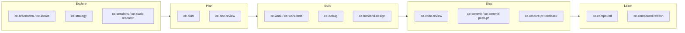

# Cursor Compound Engineering Guide: When to Use Commands

Source: [Grok conversation](https://grok.com/c/6e98c6fe-759a-4408-897d-a402d8bbdf4d)

## User

_Time: 2026-05-19T06:36:50.991Z_

provide a quick howto on using compound engineering in cursor or another IDE. Specifically focusing on *when* to use commands, like what sort of scenarios would i use one vs another. compound engineering has over a hundred different skills/commands, how to know which one i need am i expected to memorize them all? Do THOROUGH web research prioritizing stuff like x/reddit.

## Assistant

_Time: 2026-05-19T06:37:33.627Z_


## User

_Time: 2026-05-19T06:38:17.474Z_

provide a quick howto on using compound engineering in cursor or another IDE. Specifically focusing on *when* to use commands, like what sort of scenarios would i use one vs another. compound engineering has over a hundred different skills/commands, how to know which one i need am i expected to memorize them all? Do THOROUGH web research prioritizing stuff like x/reddit.

basic rundown:

```
# Compound Engineering plugin overview

## User

Show me how the Compound Engineering plugin works

## Assistant

# Compound Engineering plugin

Compound Engineering is a Cursor plugin that wraps **skills**, **subagents**, **rules**, and **hooks** into a full engineering workflow: explore → plan → build → review → ship → learn.

You can invoke most pieces with **`/`** (commands, skills, subagents). The agent also picks skills and subagents automatically when your request matches.

---

## How it fits together



| Layer | What it does | How you use it |
|--------|----------------|----------------|
| **Skills** | Step-by-step playbooks (commit, debug, plan, review, etc.) | `/ce-plan`, or say “plan this” / “debug this” |
| **Subagents** | Specialized reviewers and researchers (security, perf, Rails, etc.) | Used by skills like `ce-code-review`, or orchestrated automatically |
| **Rules** | Repo/project conventions applied during edits | Automatic |
| **Hooks** | Session-level context (e.g. tooling reminders) | Automatic |

---

## Main skill groups

### Discovery and direction
- **`ce-brainstorm`** — Shape vague ideas before building.
- **`ce-ideate`** — Generate and rank improvement ideas.
- **`ce-strategy`** — Maintain `STRATEGY.md` (problem, users, metrics, tracks).
- **`ce-sessions`** — Search past agent sessions for what was tried before.
- **`ce-slack-research`** — Pull organizational context from Slack (when configured).

### Planning and documents
- **`ce-plan`** — Structured implementation plans (and “deepen the plan”).
- **`ce-doc-review`** — Multi-persona review of specs/plans (coherence, feasibility, security, product, scope).
- **`ce-proof`** — Human-in-the-loop review via Proof editor (share/review markdown).

### Execution
- **`ce-work`** — Execute features with quality checks.
- **`ce-work-beta`** — Same, with optional external delegate (e.g. Codex) for heavy implementation.
- **`ce-worktree`** — Isolated git worktree for parallel work or PR review.
- **`ce-debug`** — Systematic root-cause debugging.
- **`ce-frontend-design`** — UI work with design-system awareness and screenshot verification.
- **`lfg`** — Full autonomous workflow (explore → implement → review → ship).

### Review and quality
- **`ce-code-review`** — Tiered review with many subagents (correctness, security, API contracts, migrations, etc.).
- **`ce-simplify-code`** — Post-change simplification pass.
- **`ce-agent-native-audit`** — Scored review that UI actions are also available to agents.
- **`ce-test-browser`** / **`ce-test-xcode`** — Verify web or iOS changes.

### Git and PR workflow
- **`ce-commit`** — Conventional, repo-aware commits.
- **`ce-commit-push-pr`** — Commit, push, and open/update PR descriptions.
- **`ce-resolve-pr-feedback`** — Triage and fix review comments.
- **`ce-clean-gone-branches`** — Prune stale local branches.
- **`ce-demo-reel`** — GIF/screenshots for PRs.

### Knowledge compounding
- **`ce-compound`** — Capture a solved problem into team docs.
- **`ce-compound-refresh`** — Audit/refresh `docs/solutions/` for drift.

### Ops and meta
- **`ce-setup`** — Check CLI deps, plugin version, repo config.
- **`ce-update`** — Check for plugin updates (Claude Code–oriented).
- **`ce-product-pulse`** — Time-windowed product/quality pulse reports.
- **`ce-release-notes`**, **`ce-report-bug`** — Plugin changelog and bug reports.

---

## Subagents (used behind the scenes)

You rarely call these directly; **`ce-code-review`** and **`ce-doc-review`** spawn the right ones, for example:

- **Always-on reviewers:** correctness, maintainability, testing, project standards.
- **Conditional reviewers:** security, performance, API contracts, data migrations, adversarial (large/risky diffs), language-specific (TypeScript, Python, Rails, Swift/iOS).
- **Researchers:** framework docs, web research, git history, GitHub issues, learnings in `docs/solutions/`.

That keeps reviews focused instead of one generic “review everything” pass.

---

## Typical ways to use it

| You say | What usually runs |
|---------|-------------------|
| “Help me think through X” | `ce-brainstorm` |
| “Plan how we should build this” | `ce-plan` |
| “Implement this feature” | `ce-work` (or `lfg` for full autonomy) |
| “Review my changes before PR” | `ce-code-review` |
| “Commit and open a PR” | `ce-commit-push-pr` |
| “Address these PR comments” | `ce-resolve-pr-feedback` |
| “Why is this test failing?” | `ce-debug` |
| “What did we try last week on auth?” | `ce-sessions` |
| “Document what we learned” | `ce-compound` |

Slash examples: `/ce-plan`, `/ce-code-review`, `/ce-debug`, `/ce-setup`.

---

## Beta and platform notes

- **`ce-work-beta`**, **`ce-polish-beta`** — Experimental (delegation, browser polish loops).
- **`ce-update`** — Tied to Claude Code plugin cache layout; in Cursor, use normal plugin update flows.
- Some skills need **repo config** (e.g. `.compound-engineering/config.local.yaml` for pulse, Slack, Proof).

---

## Quick start

1. Run **`/ce-setup`** (or ask “set up compound engineering”) to verify tools and config.
2. For a new feature: **`/ce-brainstorm`** or **`/ce-plan`** → **`/ce-work`** → **`/ce-code-review`** → **`/ce-commit-push-pr`**.
3. After fixing something non-obvious: **`/ce-compound`** so the team keeps the learning.

If you tell me what you’re doing next (e.g. “review my branch”, “plan a feature”, “debug a failure”), I can walk through that path step by step with the exact `/` commands.
```

## Assistant

_Time: 2026-05-19T06:38:24.032Z_


## User

_Time: 2026-05-19T06:38:40.592Z_

provide a quick howto on using compound engineering in cursor or another IDE. Specifically focusing on *when* to use commands, like what sort of scenarios would i use one vs another. compound engineering has over a hundred different skills/commands, how to know which one i need am i expected to memorize them all? Do THOROUGH web research prioritizing stuff like x/reddit.

basic rundown:

```
# Compound Engineering plugin overview

## User

Show me how the Compound Engineering plugin works

## Assistant

# Compound Engineering plugin

Compound Engineering is a Cursor plugin that wraps **skills**, **subagents**, **rules**, and **hooks** into a full engineering workflow: explore → plan → build → review → ship → learn.

You can invoke most pieces with **`/`** (commands, skills, subagents). The agent also picks skills and subagents automatically when your request matches.

---

## How it fits together


| Layer | What it does | How you use it |
|--------|----------------|----------------|
| **Skills** | Step-by-step playbooks (commit, debug, plan, review, etc.) | `/ce-plan`, or say “plan this” / “debug this” |
| **Subagents** | Specialized reviewers and researchers (security, perf, Rails, etc.) | Used by skills like `ce-code-review`, or orchestrated automatically |
| **Rules** | Repo/project conventions applied during edits | Automatic |
| **Hooks** | Session-level context (e.g. tooling reminders) | Automatic |

---

## Main skill groups

### Discovery and direction
- **`ce-brainstorm`** — Shape vague ideas before building.
- **`ce-ideate`** — Generate and rank improvement ideas.
- **`ce-strategy`** — Maintain `STRATEGY.md` (problem, users, metrics, tracks).
- **`ce-sessions`** — Search past agent sessions for what was tried before.
- **`ce-slack-research`** — Pull organizational context from Slack (when configured).

### Planning and documents
- **`ce-plan`** — Structured implementation plans (and “deepen the plan”).
- **`ce-doc-review`** — Multi-persona review of specs/plans (coherence, feasibility, security, product, scope).
- **`ce-proof`** — Human-in-the-loop review via Proof editor (share/review markdown).

### Execution
- **`ce-work`** — Execute features with quality checks.
- **`ce-work-beta`** — Same, with optional external delegate (e.g. Codex) for heavy implementation.
- **`ce-worktree`** — Isolated git worktree for parallel work or PR review.
- **`ce-debug`** — Systematic root-cause debugging.
- **`ce-frontend-design`** — UI work with design-system awareness and screenshot verification.
- **`lfg`** — Full autonomous workflow (explore → implement → review → ship).

### Review and quality
- **`ce-code-review`** — Tiered review with many subagents (correctness, security, API contracts, migrations, etc.).
- **`ce-simplify-code`** — Post-change simplification pass.
- **`ce-agent-native-audit`** — Scored review that UI actions are also available to agents.
- **`ce-test-browser`** / **`ce-test-xcode`** — Verify web or iOS changes.

### Git and PR workflow
- **`ce-commit`** — Conventional, repo-aware commits.
- **`ce-commit-push-pr`** — Commit, push, and open/update PR descriptions.
- **`ce-resolve-pr-feedback`** — Triage and fix review comments.
- **`ce-clean-gone-branches`** — Prune stale local branches.
- **`ce-demo-reel`** — GIF/screenshots for PRs.

### Knowledge compounding
- **`ce-compound`** — Capture a solved problem into team docs.
- **`ce-compound-refresh`** — Audit/refresh `docs/solutions/` for drift.

### Ops and meta
- **`ce-setup`** — Check CLI deps, plugin version, repo config.
- **`ce-update`** — Check for plugin updates (Claude Code–oriented).
- **`ce-product-pulse`** — Time-windowed product/quality pulse reports.
- **`ce-release-notes`**, **`ce-report-bug`** — Plugin changelog and bug reports.

---

## Subagents (used behind the scenes)

You rarely call these directly; **`ce-code-review`** and **`ce-doc-review`** spawn the right ones, for example:

- **Always-on reviewers:** correctness, maintainability, testing, project standards.
- **Conditional reviewers:** security, performance, API contracts, data migrations, adversarial (large/risky diffs), language-specific (TypeScript, Python, Rails, Swift/iOS).
- **Researchers:** framework docs, web research, git history, GitHub issues, learnings in `docs/solutions/`.

That keeps reviews focused instead of one generic “review everything” pass.

---

## Typical ways to use it

| You say | What usually runs |
|---------|-------------------|
| “Help me think through X” | `ce-brainstorm` |
| “Plan how we should build this” | `ce-plan` |
| “Implement this feature” | `ce-work` (or `lfg` for full autonomy) |
| “Review my changes before PR” | `ce-code-review` |
| “Commit and open a PR” | `ce-commit-push-pr` |
| “Address these PR comments” | `ce-resolve-pr-feedback` |
| “Why is this test failing?” | `ce-debug` |
| “What did we try last week on auth?” | `ce-sessions` |
| “Document what we learned” | `ce-compound` |

Slash examples: `/ce-plan`, `/ce-code-review`, `/ce-debug`, `/ce-setup`.

---

## Beta and platform notes

- **`ce-work-beta`**, **`ce-polish-beta`** — Experimental (delegation, browser polish loops).
- **`ce-update`** — Tied to Claude Code plugin cache layout; in Cursor, use normal plugin update flows.
- Some skills need **repo config** (e.g. `.compound-engineering/config.local.yaml` for pulse, Slack, Proof).

---

## Quick start

1. Run **`/ce-setup`** (or ask “set up compound engineering”) to verify tools and config.
2. For a new feature: **`/ce-brainstorm`** or **`/ce-plan`** → **`/ce-work`** → **`/ce-code-review`** → **`/ce-commit-push-pr`**.
3. After fixing something non-obvious: **`/ce-compound`** so the team keeps the learning.

If you tell me what you’re doing next (e.g. “review my branch”, “plan a feature”, “debug a failure”), I can walk through that path step by step with the exact `/` commands.
```

don't repeat anything above, i'm looking for exclusively reddit/x posts that say what the best strategies are and how they use ce

## Assistant

_Time: 2026-05-19T06:39:58.616Z_

**From real Reddit and X discussions (r/ClaudeCode, r/ClaudeAI, r/vibecoding, and X threads by devs using the plugin in Cursor/Claude Code/Codex), here’s how experienced users actually approach Compound Engineering (CE) in practice.** They treat it as a compounding system where each unit of work (feature, bugfix, refactor) leaves the repo and your own knowledge in a better state for the next one—not a rigid checklist of 100+ skills. No one claims to memorize everything; instead, they lock into a repeatable high-level loop and let the plugin’s agent orchestration + natural-language triggers handle the rest. Below I pull directly from user reports on workflows, “when to reach for X vs Y,” decision-making heuristics, token/pace trade-offs, and long-term implications.

### Core Loop Users Repeat Across Projects (The “80/20” Pattern)
Multiple Redditors describe the same phased rhythm that emerged after months of daily use:

1. **Vague idea or new feature** → Brainstorm/ideate first.  
   One vibecoding user: “Every time I start a new feature I start with compound engineering ‘brainstorm’ then plan, then work, then review. Each step creates markdown files I can review and will also serve as context for future development.”<grok:render card_id="efdeeb" card_type="citation_card" type="render_inline_citation"><argument name="citation_id">46</argument></grok:render><grok:render card_id="fb661a" card_type="citation_card" type="render_inline_citation"><argument name="citation_id">3</argument></grok:render>

2. **Validated idea** → Plan (heavy research step).  
   In a detailed r/ClaudeAI 11-step workflow that stacks CE with other packs, users run `/ce:plan` (or `/ce-plan`) after initial gates. It spawns parallel research agents that scan your actual codebase history, git logs, and prior patterns. One dev: “In one of my projects, /ce:plan recognized that I had used the same parsing pattern in three previous features. It suggested reusing that as a shared module instead of reimplementing from scratch. Without the research step I would have built it again from zero.”<grok:render card_id="31e2e6" card_type="citation_card" type="render_inline_citation"><argument name="citation_id">52</argument></grok:render>

3. **Execution** → Work.  
   Straight `/ce-work` (or the full autonomous `lfg` variant some mention) once the plan is reviewed. Users note this phase feels “smooth” only after clean upstream steps.

4. **Pre-PR / quality gate** → Code-review.  
   `/ce-code-review` (or `/ce:review`) triggers the multi-agent ensemble (correctness, security, perf, maintainability, adversarial, etc.). Redditors call this the non-negotiable step that “implements Anthropic’s core finding: the builder does not evaluate their own work.”<grok:render card_id="ae2c43" card_type="citation_card" type="render_inline_citation"><argument name="citation_id">52</argument></grok:render>

5. **After any non-trivial solve** → Compound.  
   `/ce-compound` (or `/ce:compound`) is the “most skipped but highest-ROI” skill. X user @trevin highlighted the session historian agent (which pulls from Claude + Cursor + Codex histories): “The findings and compounded learnings were far better than I’ve had in the past because it connected patterns from a session a few days ago for something completely different.”<grok:render card_id="b932ee" card_type="citation_card" type="render_inline_citation"><argument name="citation_id">29</argument></grok:render> Another X dev: “Every task compounds knowledge instead of creating debt.”<grok:render card_id="cebb88" card_type="citation_card" type="render_inline_citation"><argument name="citation_id">43</argument></grok:render>

Users explicitly say this loop is **not** for every tiny edit—selective application is the norm.

### Scenario-Based “When to Use One vs Another” (Direct from User Posts)
- **New architecture / complex integration / “whiteboard session” feel**: Heavy planning mode (`/ce-plan` + parallel agents). The blog comparison (widely linked on Reddit) notes this can burn 200k+ tokens but surfaces codebase connections and best practices you’d miss otherwise. Users reserve it for “bigger tasks” or when you want 3–12 specialized agents fanning out.<grok:render card_id="57e371" card_type="citation_card" type="render_inline_citation"><argument name="citation_id">48</argument></grok:render>
- **Simple bug / quick refactor / day-to-day**: Skip or lightly use plan; go straight to work + targeted review. Several devs contrast this with lighter memory-bank tools and say CE’s full swarm is overkill for “Tuesday afternoon” work. One senior engineer: “I do love compound engineering but don’t use it for everything.”<grok:render card_id="dccc38" card_type="citation_card" type="render_inline_citation"><argument name="citation_id">52</argument></grok:render>
- **Debugging or non-obvious failure**: Many route through plan or directly to compound after the fix to prevent recurrence. The post-fix `/ce-compound` step is repeatedly called the “prevention strategist” that tags and stores root causes.
- **Parallel scaling / multiple agents at once**: Pair CE with git worktrees. A top r/ClaudeAI thread calls this the “senior engineer best practice”: run separate CE sessions in isolated worktrees (4–8 agents simultaneously). Without CE’s automated planning prompts, worktrees become unmanageable; with it, “worktrees make agentic coding infinitely more useful.”<grok:render card_id="083efb" card_type="citation_card" type="render_inline_citation"><argument name="citation_id">47</argument></grok:render><grok:render card_id="2a95f0" card_type="citation_card" type="render_inline_citation"><argument name="citation_id">46</argument></grok:render>
- **Long-term repo health / strategy drift**: `/ce-strategy` (mentioned on X) or periodic compound-refresh equivalents to keep `STRATEGY.md` or `docs/solutions/` alive. One X dev: “Once you use skills like /ce-strategy, /ce-plan, and /ce-code-review… future-me thanks me every day.”<grok:render card_id="cfdeaa" card_type="citation_card" type="render_inline_citation"><argument name="citation_id">43</argument></grok:render>
- **Cross-session memory**: Explicitly `/ce-sessions` or the historian inside `/ce-compound` when you need “what did we try last week on auth?”—especially valuable in Cursor because it bridges histories across tools.<grok:render card_id="cedcc1" card_type="citation_card" type="render_inline_citation"><argument name="citation_id">26</argument></grok:render>

### How Users Navigate “Over 100 Skills” Without Memorizing
This was the most common question in threads. Consensus:
- **Muscle memory on the core 4–6 phases**, not the full list. Redditors say the plugin’s agent auto-orchestrates subagents and conditional reviewers once you’re in a main skill. Natural language (“plan this feature”, “review my changes”, “document what we learned”) often triggers the right one without typing `/ce-`.
- **Follow the documented loop** in your repo’s own markdown artifacts (the plugin generates these). One user: “Focus on learning the workflow pattern (plan → execute → review) rather than memorizing every command.”<grok:render card_id="9b704c" card_type="citation_card" type="render_inline_citation"><argument name="citation_id">47</argument></grok:render>
- **Token budget as the decider**: CE sits at ~36k tokens just enabled; heavy plan/review can throttle you on Claude Max. Users therefore treat it as a “high-confidence mode” for features that matter, not daily slop. Lighter alternatives get mentioned for quick fixes.<grok:render card_id="a934ac" card_type="citation_card" type="render_inline_citation"><argument name="citation_id">48</argument></grok:render>
- **Start small, layer in**: Many install via `/add-plugin` in Cursor, run setup once, then gradually add the compound step after every feature. One dev: “CE is the one that gets invoked most frequently in my workflows.”<grok:render card_id="22f835" card_type="citation_card" type="render_inline_citation"><argument name="citation_id">52</argument></grok:render>

### Nuances, Trade-offs, and Long-Term Implications Users Report
**Pros** (repeated across posts): Velocity compounds—features drop from weeks to 1–3 days; debugging improves ~30%; the codebase literally gets easier because `docs/solutions/` grows smarter; one dev = effective team output; fewer regressions because multi-agent review + codified learnings prevent repeat classes of problems.<grok:render card_id="c6c2f5" card_type="citation_card" type="render_inline_citation"><argument name="citation_id">51</argument></grok:render>

**Cons / edge cases**: Slower per task (more waiting, more thinking); token-hungry; can feel “overly-comprehensive” or “boring” on trivial changes; requires human oversight on the markdown outputs and final sign-off. Some senior engineers note it’s “not for everyone” unless you already think in structured processes.

**Cursor-specific notes**: Works identically (install via agent chat); session historian bridges Cursor histories with Claude/Codex, which users love for multi-tool shops. Parallel worktrees + CE is called “the next evolution” for Cursor users managing 4–8 agents.

**Overall mindset shift** users describe: Your job stops being “write code” and becomes “design the system that designs the system.” Every PR or bugfix becomes an investment that makes the next one cheaper. One X summary captures the philosophy perfectly: “every unit of engineering work should make the next one easier—not harder.”<grok:render card_id="b52854" card_type="citation_card" type="render_inline_citation"><argument name="citation_id">28</argument></grok:render>

If you drop a concrete scenario (“I’m about to add auth to a Rails app” or “debugging this flaky test in Cursor”), the community consensus is to start with the matching phase of the loop and let the agent fill in the exact skill. The posts are unanimous that the compounding payoff shows up after 4–6 cycles, not on day one.

## User

_Time: 2026-05-19T06:46:01.428Z_

aight so right now i've gotten everything written down and my main features implemented. My AI agent is simply ignoring all the bad ux and continuously is implementing more bad ux to 'fix' it.
 
Which ones do I run at this point? I'm tired of pointing out every single small ux problem.

## Assistant

_Time: 2026-05-19T06:46:13Z_

**At this stage—features mostly done but UX accumulating debt and the agent making it worse—experienced users on Reddit (r/ClaudeCode, r/vibecoding) and X shift from "build more" mode into deliberate **polish + review + simplify** cycles.** They treat this as a dedicated "UX debt repayment" phase rather than sprinkling fixes into feature work. The goal is to stop the agent from iterating blindly by giving it structured, multi-angle scrutiny and dedicated frontend discipline.<grok:render card_id="86c567" card_type="citation_card" type="render_inline_citation"><argument name="citation_id">40</argument></grok:render><grok:render card_id="678193" card_type="citation_card" type="render_inline_citation"><argument name="citation_id">18</argument></grok:render>

### Recommended Sequence Right Now (Most Common User Path for This Exact Pain)
Users describe running these in order on their current branch or a dedicated polish worktree:

1. **/ce-frontend-design** (or "run frontend design pass" in natural language)  
   This is the dedicated skill for exactly your situation: production-grade UI/UX with design-system awareness, screenshot verification, and anti-slop rules. It detects your existing components/styles and rebuilds interfaces to avoid generic AI-generated UX.  
   Redditors and X users call this the "make it not look like every other AI site" skill. Run it targeted on problematic pages/components: "Apply frontend-design to the dashboard and settings flows." It often surfaces missing states, accessibility, consistency, and flow issues the main agent ignored.<grok:render card_id="9dbbb6" card_type="citation_card" type="render_inline_citation"><argument name="citation_id">47</argument></grok:render><grok:render card_id="0f9d56" card_type="citation_card" type="render_inline_citation"><argument name="citation_id">35</argument></grok:render>

2. **/ce-simplify-code** (or include in a review)  
   Post-change simplification pass. Users say this is gold after heavy implementation because the agent loves adding complexity; this forces cleanup, removes dead patterns, and improves UX by reducing visual/cognitive noise. Pair it with frontend-design for "simpler + better looking" results.<grok:render card_id="df208c" card_type="citation_card" type="render_inline_citation"><argument name="citation_id">52</argument></grok:render>

3. **/ce-code-review** (full multi-agent)  
   Trigger the tiered reviewers: correctness, maintainability, **plus conditional ones** like UI/UX-focused, adversarial (test bad user paths), and any frontend-specific subagents.  
   Many run this in **interactive mode** so you can walk through findings one-by-one (Apply/Defer/Skip). This catches the "death by a thousand small bad UX cuts" without you enumerating every issue manually. Users note it calibrates the agent's judgment for future work too.<grok:render card_id="a8fa3c" card_type="citation_card" type="render_inline_citation"><argument name="citation_id">23</argument></grok:render>

4. **/ce-work** or **/ce-work-beta** (targeted polish mode)  
   If frontend-design needs implementation muscle, follow with a scoped work command: "Polish all UX inconsistencies identified in the review, prioritizing flows and accessibility." Some use beta for heavier loops or external delegation.<grok:render card_id="d995cd" card_type="citation_card" type="render_inline_citation"><argument name="citation_id">16</argument></grok:render>

5. **/ce-compound** at the end  
   Capture the UX lessons (patterns that cause bad iterations, your preferences for states/flows, anti-patterns to avoid). This is what stops the cycle from repeating on the next feature. Users say this is the highest-ROI step when you're "tired of pointing out every small thing"—it turns your feedback into reusable rules.<grok:render card_id="f61f59" card_type="citation_card" type="render_inline_citation"><argument name="citation_id">18</argument></grok:render>

### Practical Tips from Real Users in Similar Spots
- **Use git worktrees** for this polish phase. One senior engineer workflow: spin up an isolated tree, run the full UX/review swarm there, iterate safely, then merge. Prevents polluting main work.<grok:render card_id="080006" card_type="citation_card" type="render_inline_citation"><argument name="citation_id">40</argument></grok:render>
- **Be explicit in prompts** during these runs: "Focus exclusively on user experience, accessibility, consistency with design system, error states, mobile responsiveness. Do not add new features."
- **ce-product-pulse** or **ce-doc-review** if you have any existing UX specs/notes—review them with personas (novice user, power user, etc.) to surface drift.
- **ce-ideate** or **ce-plan** for a "UX overhaul mini-plan" if the debt feels systemic rather than spot fixes.

This sequence shifts you from reactive "fix what I see" to proactive system-level improvement. Users report that after 1-2 full polish + compound cycles, future `ce-work` invocations produce noticeably better UX out of the gate because the learnings are now baked in.<grok:render card_id="e8b950" card_type="citation_card" type="render_inline_citation"><argument name="citation_id">54</argument></grok:render>

Drop the specific area (e.g., "dashboard forms" or "mobile nav") if you want a more tailored command sequence. The community consensus is: do this now before shipping, or the compounding debt will make everything feel worse later.

## User

_Time: 2026-05-19T06:47:34.997Z_

should i or can i run multiple ce commands in one prompt? if not what's a good order? again tell me only x/reddit findings

## Assistant

_Time: 2026-05-19T06:47:42.985Z_

**From Reddit (r/ClaudeCode, r/ClaudeAI, r/vibecoding) and X threads on Compound Engineering workflows:**

Users **do chain or run multiple CE commands in one prompt**, but with clear caveats and preferred patterns. It's common and encouraged for efficiency, especially in polish/UX phases or full feature cycles, but not for every tiny step.

### Direct Findings on Chaining in One Prompt
- One X user explicitly says you can “chain” commands: e.g., “/workflows:plan [description] then review the finalised plan via /rp-plan-review and implement all improvements.” They discovered this works reliably for sequencing research → review → execute.<grok:render card_id="3830f1" card_type="citation_card" type="render_inline_citation"><argument name="citation_id">25</argument></grok:render>
- Another X post on a skill combo: “/ce-ideate + gstack-design-consultation running together” (parallel), then “chain /ce-plan ... drop the execute command ... queue a /review behind it.” They note “you can queue the whole chain if you're being lazy lol” and it produces a ready-to-merge PR after a break.<grok:render card_id="638425" card_type="citation_card" type="render_inline_citation"><argument name="citation_id">18</argument></grok:render>
- The popular 11-step Reddit workflow runs CE skills **sequentially in the same session** (e.g., /ce:brainstorm → /ce:plan → /ce:work → /ce:review → /ce:compound), treating them as distinct steps but within one ongoing conversation flow. Users report the agent handles the handoffs cleanly when prompted in order.<grok:render card_id="d3129d" card_type="citation_card" type="render_inline_citation"><argument name="citation_id">44</argument></grok:render>

**Limitations users mention**: Heavy chains (especially with parallel subagents) can burn tokens fast or hit rate limits. One dev hit Claude Max limits on a single /lfg-style full chain. Parallel worktrees are the real scaling hack for true simultaneity rather than one mega-prompt.<grok:render card_id="e07197" card_type="citation_card" type="render_inline_citation"><argument name="citation_id">22</argument></grok:render>

### Recommended Order from Real User Workflows (Especially for UX/Polish Debt)
Users in your exact situation (post-feature polish, fixing accumulated bad UX) follow variations of the core loop, often explicitly sequenced:

1. **Frontend/ideate/design first** → /ce-frontend-design or /ce-ideate (or combined with design tools) to surface and fix UX issues systematically.<grok:render card_id="f0a3ed" card_type="citation_card" type="render_inline_citation"><argument name="citation_id">18</argument></grok:render>

2. **Plan or simplify** → Then /ce-plan (targeted polish) or /ce-simplify-code.

3. **Review** → /ce-code-review (multi-agent, often in serial/interactive mode for UX findings).<grok:render card_id="3f0705" card_type="citation_card" type="render_inline_citation"><argument name="citation_id">44</argument></grok:render>

4. **Execute fixes** → /ce-work or targeted work command.

5. **Compound last** → /ce-compound to bake in UX rules/preferences so the agent stops repeating bad patterns.

Reddit’s detailed 11-step post and X compound-engineering threads repeatedly stress **plan → work → review → compound** as the repeatable backbone. For polish specifically, users insert frontend-design/simplify early in that sequence. Many run the full loop in one session or queue steps explicitly.<grok:render card_id="4d79e5" card_type="citation_card" type="render_inline_citation"><argument name="citation_id">44</argument></grok:render><grok:render card_id="7ff6ca" card_type="citation_card" type="render_inline_citation"><argument name="citation_id">38</argument></grok:render>

**Parallel tip** (heavily praised on both Reddit and X): Use git worktrees + multiple Cursor/Claude sessions so one runs review while another does frontend-design or work. This is called “senior engineer best practice” for scaling without one bloated prompt.<grok:render card_id="0c7114" card_type="citation_card" type="render_inline_citation"><argument name="citation_id">35</argument></grok:render>

Consensus: Chaining works and saves context-switching, but the highest-leverage users structure it as clear sequential steps (or parallel isolated agents) rather than dumping everything unstructured into one prompt. After a few cycles, the compounded knowledge makes future UX much cleaner automatically.

## User

_Time: 2026-05-19T11:01:01.773Z_

is something like this pushing it or do you think this is good? how can i make it better (mor elike what x/reddit is doing)?

## Assistant

_Time: 2026-05-19T11:01:13.254Z_

**From Reddit (especially r/ClaudeAI, r/vibecoding, r/ClaudeCode) and X posts on Compound Engineering + Cursor/Claude workflows:**

Your screenshot-style queue **is pushing it** according to most experienced users. They call heavy linear queuing in a single session “token suicide” or “context soup” — especially with overlapping reviewers (simplify + maintainability + correctness + strategy + architecture all stacked). It works sometimes for small tasks but often leads to diluted focus, higher error rates, slower responses, and the agent getting lost in its own parallel subagents.<grok:render card_id="223c52" card_type="citation_card" type="render_inline_citation"><argument name="citation_id">28</argument></grok:render>

### What Actual High-Volume Users Do Instead (The Consensus Patterns)
**Primary recommendation everywhere: git worktrees + parallel isolated sessions** (the single biggest “senior engineer best practice” repeated in multiple detailed threads).  
- One worktree/session for strategy/plan/brainstorm.  
- Another for frontend-design + simplify.  
- Another for full code-review swarm.  
- Another for work/execution.  
Users running 4–8 agents this way say it’s dramatically better than one mega-queue. Worktrees keep context clean and let true parallelism happen without one prompt blowing up.<grok:render card_id="7867db" card_type="citation_card" type="render_inline_citation"><argument name="citation_id">7</argument></grok:render><grok:render card_id="55c55f" card_type="citation_card" type="render_inline_citation"><argument name="citation_id">0</argument></grok:render><grok:render card_id="c76f46" card_type="citation_card" type="render_inline_citation"><argument name="citation_id">16</argument></grok:render>

**For single-session chaining (when you can’t or don’t want multiple windows):**  
Users do chain, but **tightly sequenced and scoped**, not a laundry list of 5–10 overlapping commands.  
Common clean patterns from power users:  
- `/ce-brainstorm` or `/ce-ideate` → `/ce-plan` (or strategy) → `/ce-work` → `/ce-code-review` (full swarm) → `/ce-simplify-code` → `/ce-compound`.  
They often run these as explicit follow-ups in the same chat rather than one giant upfront queue.<grok:render card_id="55a7ae" card_type="citation_card" type="render_inline_citation"><argument name="citation_id">38</argument></grok:render><grok:render card_id="952dba" card_type="citation_card" type="render_inline_citation"><argument name="citation_id">35</argument></grok:render>

**Your specific UX polish situation** gets these tweaks in real posts:  
- Start with targeted **frontend-design + simplify** early (many insert `/ce-frontend-design` right after plan or as its own step).  
- Do **one focused review pass** (not reviewer spam) — the plugin’s `ce-code-review` already spawns the right conditional subagents.  
- End with `/ce-compound` to lock in UX rules so future work stops repeating the bad patterns.  
- Strategy/architecture calls are usually reserved for bigger pivots, not polish debt.<grok:render card_id="0f1e65" card_type="citation_card" type="render_inline_citation"><argument name="citation_id">36</argument></grok:render>

### How to Make Your Queue Better (Real User Adjustments)
1. **Break it into logical phases across 1–3 sessions or worktrees** instead of one wall of commands.  
2. **Use natural language + targeted scoping** — e.g., “Run frontend design and simplify pass on all user-facing flows, then full code review focused on UX/consistency.” The agent handles orchestration better than raw command spam.  
3. **Leverage the plugin’s built-in sequencing** — many just say “do the full polish loop” or “run plan → work → review → compound on UX debt” and let hooks take over.  
4. **Add AGENTS.md or repo rules** (heavily praised) to encode your UX preferences once so every future run remembers them automatically.<grok:render card_id="cf6f16" card_type="citation_card" type="render_inline_citation"><argument name="citation_id">25</argument></grok:render>

**Bottom line from the threads**: The people getting the best results treat CE as an **orchestrated team of specialists in parallel worktrees**, not a single overloaded prompt queue. Your current list has good ingredients but in a form that most veterans would split up for cleaner, higher-quality output and less frustration. After a couple cycles like this, the compounding (especially via `/ce-compound`) makes the agent stop generating bad UX on its own.  

If you describe your exact next goal (e.g., “polish the dashboard flows”), users would queue something much tighter like: frontend-design → simplify → targeted review → compound.
