# Discovery backlog P1–P4 implementation plan

## Origin and intent

**Origin document:** `docs/brainstorms/2026-06-29-discovery-backlog-requirements.md`

Implement incremental discovery-hub improvements in priority order **P1 → P2 → P3 → P4**, aligned with `STRATEGY.md` dual-chrome product model. **P5 (status subscriptions) is deferred** — documented only, no implementation units.

## Problem

After cohesion passes, discovery routes share `PageLayout` and heroes, but four gaps remain: mobile guide in-page navigation, nav search exiting to a new tab, static “future” placeholders, and no env-driven single-theme deployment. Unified search cannot reuse the current SearX route as-is because `/api/searx/search` only **redirects** (307) to SearX — it does not return JSON for an on-site results page.

## Success criteria (traceability)

| ID | Requirement | Plan coverage |
|----|-------------|---------------|
| R1 | Mobile guide “On this page” under title; desktop `SideToc` unchanged | U1 |
| R2 | Env-driven single-theme shell on `/about` without merging IA | U2 |
| R3 | Real release activity in home future section | U3 |
| R4 | On-site `/search?q=…` using SearX when API available | U4 |
| R5 | Status subscriptions documented as Phase 2 | Deferred section |

## Resolved open questions (Phase 5.1.5)

| Q | Decision | Rationale |
|---|----------|-----------|
| Q1 Release feed source | **GitHub releases/tags (option A)** | Matches K4; reuses `GITHUB_TOKEN`, `fetchUserRepos`, and cache patterns in `src/lib/github*.ts`. RSS remains optional env override in U3 if GitHub fetch fails. |
| Q2 Search quick filters | **Defer to v2** | P4 ships web-only SearX results; local guide/project filter adds indexing scope. |
| Q3 OG on forced discovery chrome | **Keep portfolio OG** | `/about/opengraph-image` reflects page content (portfolio narrative), not nav shell. Document in README dual-chrome table. |

## Scope

**In:** P1–P4 as four implementation units; config/env docs; GitHub Pages search fallback UX.

**Deferred (explicit):**

- **P5** — Status subscriptions (webhook/email, poller, storage) — Phase 2; see [Deferred: P5](#deferred-p5-status-subscriptions).
- `/projects` SideToc until anchored sections exist.
- Search filters (guides vs web).
- Merging portfolio and discovery nav IA.

**Outside identity:** Database, auth, replacing iframe embeds with native UIs.

## Architecture overview

```mermaid
flowchart TB
  subgraph P1 [U1 Guide TOC]
    MD[guide.content] --> EMH[extractMarkdownHeadings]
    EMH --> SideToc[SideToc md+ desktop]
    EMH --> Inline[GuideInlineToc lt md]
  end

  subgraph P2 [U2 Chrome mode]
    CFG[NEXT_PUBLIC_CHROME_MODE] --> About["/about page shell"]
    About -->|dual| Portfolio[AboutNavigation + Footer]
    About -->|discovery| PL[PageLayout]
  end

  subgraph P3 [U3 Releases]
    GH[GitHub releases API] --> Feed[HomeFutureSection feed slot]
    Feed --> Fallback[HOME_FUTURE_PLACEHOLDERS]
  end

  subgraph P4 [U4 Search]
    Nav[MainNavbar form] --> SearchPage["/search?q="]
    SearchPage --> API["/api/searx/results JSON"]
    API --> SearX[SearXNG format=json]
    SearchPage -->|github-pages| ExtLink[External SearX link only]
  end
```

## Implementation units

### U1 — Mobile guide inline “On this page” (P1 / R1)

**Goal:** Guide readers on small viewports see h2 anchor links under the title block; desktop keeps fixed-right `SideToc`.

**Touchpoints:**

- `src/app/guides/[slug]/page.tsx` — render inline block after title metadata, before article.
- `src/components/guide-inline-toc.tsx` — **new** presentational component (or colocate in guides folder).
- `src/components/side-toc.tsx` — add optional `variant="desktop-only"` (or `hideMobileChrome`) so guide pages do not show the bottom dot timeline when inline TOC is present.

**Approach:**

1. Keep existing gate: `guideTocItems.length >= 3` before any TOC UI.
2. Pass same `guideTocItems` from `extractMarkdownHeadings(guide.content)` — no second parser.
3. Inline block: visible only below `md` (`md:hidden`), labeled “On this page”, vertical link list using `<a href="#{id}">` with smooth scroll (same ids as `rehype-slug` / `SideToc`).
4. `SideToc`: restrict mobile bottom bar to non-guide contexts OR pass prop to hide mobile chrome on guide routes.
5. Optional follow-up (not blocking): move label to `config.GUIDE_INLINE_TOC_LABEL`.

**Verification:**

- Guide with ≥3 h2: inline list visible on narrow viewport; fixed-right timeline on `md+`.
- Guide with &lt;3 h2: no inline block, no `SideToc` (unchanged).
- Clicking inline link scrolls to correct heading id.
- `/about` and other `SideToc` consumers unchanged on mobile.

**Files:** `src/app/guides/[slug]/page.tsx`, `src/components/guide-inline-toc.tsx`, `src/components/side-toc.tsx`

---

### U2 — Single-theme chrome mode (P2 / R2)

**Goal:** `NEXT_PUBLIC_CHROME_MODE=discovery` wraps `/about` in discovery `PageLayout` (nav/footer/tokens) while preserving portfolio section builder and copy.

**Touchpoints:**

- `src/lib/config.ts` — `CHROME_MODE: 'dual' | 'discovery'` via `NEXT_PUBLIC_CHROME_MODE`, default `dual`.
- `src/app/about/page.tsx` — conditional shell: `dual` → current `AboutNavigation` + `Footer`; `discovery` → `PageLayout` wrapper around same `<main>` content.
- `.env.example`, `README.md` — dual-chrome table row for `NEXT_PUBLIC_CHROME_MODE`.

**Approach:**

1. Add config flag with validation (invalid values fall back to `dual` + dev console warn in client components only if needed).
2. Extract about `<main>` body (sections loop) into inner fragment or `AboutPageContent` server component to avoid duplicating section map.
3. When `discovery`: wrap with `PageLayout`; omit `AboutNavigation` and portfolio `Footer`; keep `AboutHubStrip` and section error boundaries as today unless visually conflicting (hub strip may stay — cross-link strip is discovery-aligned).
4. Do **not** change `metadata`, `opengraph-image`, or section IDs (Q3).
5. No redirect from `/about` to `/`.

**Verification:**

- Default build: `/about` unchanged (portfolio chrome).
- `NEXT_PUBLIC_CHROME_MODE=discovery`: discovery nav/footer on `/about`; section order and content identical.
- `npm run build` with zero `.env.local` still succeeds.

**Files:** `src/lib/config.ts`, `src/app/about/page.tsx`, `.env.example`, `README.md`

---

### U3 — Release notes stream (P3 / R3)

**Goal:** Replace one static `HOME_FUTURE_PLACEHOLDERS` slot with up to 5 recent release/tag items (title, date, link).

**Touchpoints:**

- `src/lib/github-releases.ts` — **new** fetch + normalize releases/tags across `config.GITHUB_USERNAMES` (or owner repos).
- `src/app/api/github/releases/route.ts` — **new** JSON endpoint with cache headers / `revalidate` (mirror `/api/projects` error shape).
- `src/components/home-future-section.tsx` — async server wrapper or parent fetch on `src/app/page.tsx`.
- `src/lib/config.ts` — toggles: `HOME_FUTURE_RELEASES_ENABLED`, optional `HOME_FUTURE_RSS_URL` fallback (B path, secondary).

**Approach:**

1. **Primary (GitHub):** For each username in `GITHUB_USERNAMES`, fetch recent releases (`/repos/{owner}/{repo}/releases`) for top N updated repos OR use GraphQL if rate limits bite — start with REST on 3–5 repos max to cap API cost.
2. Normalize to `{ title, publishedAt, url, repo }`, sort desc, slice 5.
3. Use `GITHUB_TOKEN` when present; without token, rely on static placeholders only (no failed UI).
4. **Home UI:** First grid cell (or dedicated row) shows release feed; remaining cells keep static placeholders from env JSON.
5. Empty/failure: hide feed cell, show placeholders only (section still renders if placeholders exist).

**Verification:**

- With token + network: home shows ≥1 real release link when repos have releases.
- Without token: section matches current placeholder-only behavior.
- API returns JSON with `lastUpdated` and graceful error object on failure.

**Files:** `src/lib/github-releases.ts`, `src/app/api/github/releases/route.ts`, `src/components/home-future-section.tsx`, `src/app/page.tsx`, `src/lib/config.ts`, `.env.example`

---

### U4 — Unified on-site search (P4 / R4)

**Goal:** Nav search navigates to `/search?q=…` on the same origin; results from SearX JSON API via new server route.

**Touchpoints:**

- `src/app/search/page.tsx` — **new** client or RSC page under `PageLayout`.
- `src/app/api/searx/results/route.ts` — **new** `GET ?q=` returns `{ results, query, source, error? }`.
- `src/components/main-navbar.tsx` — `useRouter().push(\`/search?q=${encodeURIComponent(q)}\`)` instead of `window.open`.
- `src/lib/config.ts` — copy for empty/error states, external SearX link label.
- Keep existing `/api/searx/search` redirect route for backward-compatible links (showcase card, bookmarks).

**Approach:**

1. **JSON proxy:** Fetch `{SEARXNG_URL}{SEARXNG_SEARCH_PATH}?q=…&format=json` server-side with same health/fallback logic as redirect route (`SEARXNG_PUBLIC_URL` fallback).
2. Map SearX JSON to `{ title, url, snippet }[]` (cap 20 results for v1).
3. **Search page:** Read `q` from `searchParams`; server-fetch or client SWR; show query heading, result list, “Open in SearXNG” link (`config.getSearxngSearchUrl(q)`), loading and error states.
4. **GitHub Pages:** When `DEPLOY_TARGET=github-pages` (or `NEXT_PUBLIC_STATIC_EXPORT=true` flag exposed to client), search page shows message + button to external SearX only — no API call. Align copy with other API-less deploy docs in README.
5. **Defer filters (Q2):** No guide/web tabs in v1.

**Verification:**

- Docker/standalone: submit nav search → lands on `/search?q=…` with results or clear error.
- Invalid/empty query: friendly empty state.
- GitHub Pages build: search page renders fallback without 404; no dependency on `/api/*`.
- Existing `/api/searx/search?q=` redirect still works.

**Files:** `src/app/search/page.tsx`, `src/app/api/searx/results/route.ts`, `src/components/main-navbar.tsx`, `src/lib/config.ts`, `.env.example`, `README.md`

---

## Deferred: P5 status subscriptions

**Phase 2 product bet (R5 only — documentation).**

Prerequisites before any implementation:

- Durable store for subscription targets (service id + delivery endpoint).
- Auth or signed tokens for webhook URLs.
- Background poller reading `/api/services` health on an interval.
- Abuse controls on anonymous webhook registration.

**Action for this plan:** Add a short “Phase 2” subsection to `docs/brainstorms/2026-06-29-discovery-backlog-requirements.md` or `STRATEGY.md` not-working-on with link to this plan — no code.

---

## Implementation sequence

| Order | Unit | Depends on | Est. risk |
|-------|------|------------|-----------|
| 1 | U1 | — | Low |
| 2 | U2 | — | Low (layout conditional) |
| 3 | U3 | — | Medium (GitHub rate limits) |
| 4 | U4 | New JSON route | Medium (SearX JSON shape, static export) |

U1–U2 can ship independently. U3 and U4 do not block each other.

---

## Agent-native parity notes

Audit against “anything a user can do, an agent should be able to do via API/URLs”:

| User action | Today | After plan |
|-------------|-------|------------|
| Search from nav | External tab via redirect API | `GET /search?q=` + `GET /api/searx/results?q=` |
| Read guide TOC on mobile | Bottom dot nav only | Inline anchors + optional API none needed |
| View releases on home | Static env placeholders | `GET /api/github/releases` |
| Force discovery chrome on about | Not possible | `NEXT_PUBLIC_CHROME_MODE=discovery` |

**Gaps to track (post-P4):** No machine-readable guide index beyond `/guides` HTML; dashboard service state still requires scraping `/api/services` (acceptable for v1).

---

## Risks and mitigations

| Risk | Mitigation |
|------|------------|
| GitHub rate limit without token | Hide release feed; placeholders only |
| SearX instances disable JSON format | Document required SearX setting; fallback external link |
| Duplicate mobile TOC on guides | U1 hides `SideToc` mobile chrome on guide pages |
| GitHub Pages strips all `/api` | Client-detect static export; search/releases degrade gracefully |

---

## Verification checklist (pre-merge)

- [ ] `npm run build` (default env)
- [ ] `DEPLOY_TARGET=github-pages npm run build` (or CI workflow locally)
- [ ] Manual: guide page narrow viewport inline TOC
- [ ] Manual: `CHROME_MODE=discovery` on `/about`
- [ ] Manual: home release feed with `GITHUB_TOKEN`
- [ ] Manual: `/search?q=test` on dev server

---

## Key decisions (plan-level)

- **K1–K5** inherited from origin doc; Q1–Q3 resolved above.
- **New K6:** Add `/api/searx/results` JSON route; keep redirect route for compatibility.
- **New K7:** Guide mobile UX uses inline TOC; disable `SideToc` bottom bar on guide routes to avoid duplicate navigation.

---

## Delta Update (2026-06-29)

- **Landed:** U1–U4 implemented on `feat/site-cohesion-discovery-hub`: guide inline mobile TOC + `SideToc` mobile hide; `NEXT_PUBLIC_CHROME_MODE` with conditional `/about` shell; GitHub releases feed in future-blocks (`github-releases.ts`, home page fetch); on-site `/search` + `/api/searx/results`, navbar `router.push`, static-export fallback via `NEXT_PUBLIC_STATIC_EXPORT`. README and `.env.example` updated.
- **QA fixes (2026-06-29):** Unified home SearX card + resolver URLs to `/search`; enabled `future-blocks` section; deduped dashboard chart x-axis React keys; contact availability `replaceAll`; empty navbar/about search → `/search`.
- **Verified:** `npx tsc --noEmit` and `npm run build` (standalone) pass on networked host. Manual QA: guide mobile TOC, `/search` empty + query flows, future section visible, contact availability copy, no duplicate-key console noise on dashboard charts.
- **Partial:** `DEPLOY_TARGET=github-pages npm run build` still fails on pre-existing static-export constraint for `/api/projects/enhanced` (unrelated to U1–U4). P5 remains doc-only deferred.
- **Next:** Resolve GitHub Pages static export for API routes (or exclude from export build); optional `CHROME_MODE=discovery` browser pass on `/about`; push branch when ready.

---

## Related documents

- `STRATEGY.md` — dual chrome, not-working-on
- `docs/plans/2026-06-29-cohesion-medium-effort.md` — prior cohesion pass (orthogonal)
- `docs/brainstorms/2026-06-29-next-ideas.md` — source ideas
