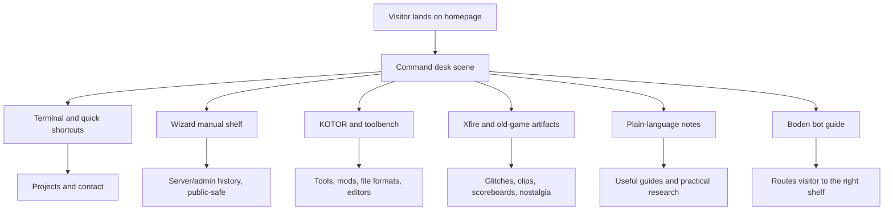

# Personality-Grounded Home Hub - Plan

## Goal Capsule

- **Objective:** Redesign the homepage into a personal, explorable hub that feels authored by Boden Crouch instead of a polished template, corporate portfolio, or generic cozy room.
- **Product authority:** The design direction is grounded in the provided Discord, Xfire, Wizard manual, Wizard talks, server-admin, KOTOR, Holocron, OpenKOTOR, Deadly Stream, speedrun, and technical-note source families.
- **Execution profile:** This is a software/UI product contract for the existing Next.js site.
- **Open blockers:** The plan can proceed without another broad corpus pass, but public copy must avoid raw private-log exposure and clinical personality claims.

---

## Product Contract

### Summary

Build a homepage that feels like a late-night modder/server-operator command desk: part old game server, part KOTOR toolbench, part bug notebook, part personal archive.
The page should be useful immediately, weird enough to remember, and written in Boden's plain, restless, self-correcting voice.

### Problem Frame

The current direction misses the assignment because it translates "whimsical" into a generic cute room.
The supplied context points somewhere sharper: old Halo/Xfire captures, command manuals, server moderation/debugging, KOTOR tooling, AI/tool frustration, direct social writing, and a habit of turning confusing systems into usable artifacts.

The site should not explain Boden from the outside.
It should feel like visitors entered a real working desk where the owner has been collecting glitches, tools, arguments, notes, half-finished ideas, and hard-won explanations for years.

### Key Decisions

- **Use "Wizard's command desk" over "cozy cabin."** The stronger archive signal is old-game server culture, scoreboards, command manuals, modding tools, and debugging logs.
- **Treat the voice as direct and self-correcting.** The writing should use plain language, visible uncertainty, corrections, questions, and short bursts of frustration instead of smooth marketing polish.
- **Make depth navigable, not dumped.** The page should reveal shelves, drawers, terminals, scoreboards, notebooks, and bot prompts without exposing raw private messages.
- **Use psychology as design inference, not diagnosis.** The site may reflect curiosity, technical restlessness, emotional openness, frustration with vague systems, and community-building energy, but it must not label Boden with clinical traits or personality-type branding.
- **Keep professional credibility as an affordance.** Recruiters and collaborators should still find projects, contact, and proof of capability, but the first impression should be personal and memorable.

### Evidence-Backed Design Signals

- The Discord corpus contains about 1.57M messages across 265 parsed message files; **PuritanWizard/Boden** (`227896831944687616`) is the sole `role:self` identity. **`wizardofchaos` is excluded** — not Boden.
- The strongest public-community themes are KOTOR discussion, mod development, tech support, Deadly Stream modding, Holocron Toolset, OpenKOTOR, AI tooling, file formats, editors, debugging, and practical questions.
- The Xfire archive is visually dominated by dark Halo/Halo CE HUDs, blue postgame carnage reports, scoreboards, old server moments, and glitch captures.
- The Wizard manual is a command-reference artifact for server administration, player expressions, aliases, RCON/admin operations, anti-caps, chat IDs, player modes, and server behavior toggles.
- The writing repeatedly uses problem-framing phrases such as "I think," "I mean," "actually," "basically," "for example," "why," and "what the," with frequent inline code and questions.

### Actors

- A1. **Curious visitor:** Wants to poke around, find something useful, and understand the person without reading a resume.
- A2. **Friend or community peer:** Wants familiar chaos, shortcuts, project updates, odd references, and artifacts that feel like Boden.
- A3. **Collaborator or recruiter:** Wants evidence of skill, judgment, and shipped work without forcing the homepage into corporate language.
- A4. **Future Boden bot:** Guides visitors through public-safe archive themes and routes them to projects, notes, tools, and contact.

### Requirements

**Identity and voice**

- R1. The homepage must sound like a personal command desk written by Boden, not a brand strategist describing Boden.
- R2. Copy must use plain language, direct questions, short corrections, and concrete nouns instead of vague inspirational language.
- R3. The design must reject generic startup, corporate portfolio, and pastoral cozy-cabin aesthetics.
- R4. The site must preserve enough roughness to feel human while staying readable and intentional.

**Visual world**

- R5. The primary scene must combine old-game HUD texture, modding workbench, command manual, and archive desk motifs.
- R6. The color palette should start from dark HUD blue-black, CRT green, command amber, desaturated beige paper, and selective warning red/orange.
- R7. Motion must feel like booting, scanning, opening drawers, hovering over artifacts, or replaying old captures rather than generic fade-in effects.
- R8. The first viewport must make the visitor understand that the page is explorable without needing a tutorial.

**Content architecture**

- R9. The page must expose immediate shortcuts to projects, search, notes/guides, contact, and current work.
- R10. The page must organize interests around lived patterns: KOTOR/tooling, old-game archaeology, AI/tool frustration, self-hosting/devops, server/admin history, music/creative work, and practical research.
- R11. Each major area must answer "why would a visitor click this?" before asking them to explore deeper.
- R12. The site must include at least one repeat-visit loop, such as rotating artifacts, "weird thing I found" cards, or a daily/weekly desk note.

**Boden bot and archive safety**

- R13. The Boden bot must behave like a desk guide, not a corporate assistant.
- R14. The bot must distinguish public-safe synthesis from raw private archive access.
- R15. The bot must route users to concrete pages, projects, and prompts instead of performing as a novelty chatbot only.
- R16. Private Discord, Xfire, audio, PDF, and personal-note sources must shape tone and taxonomy without being dumped publicly.

**Professional credibility**

- R17. Projects and technical capability must be visible from the homepage without dominating the page.
- R18. The site must show Boden as a builder of tools, debuggers, mods, explanations, and systems for messy real problems.
- R19. SEO metadata must target concrete searchable interests: Boden Crouch, KOTOR tools, Holocron Toolset, old game modding, AI tooling, self-hosting, local LLMs, and practical technical notes.
- R20. The shareable concept must be stronger than "personal website"; it should be describable as "Boden's command desk" or a similarly memorable phrase.

### Concept Model

### Key Flows

- F1. Visitor needs something useful fast.
  - **Trigger:** A visitor lands on `/`.
  - **Actors:** A1, A3
  - **Steps:** They see the command desk, choose a visible shortcut, and reach projects, search, notes, contact, or current work without exploring the whole scene.
  - **Outcome:** The page is useful within the first minute.
  - **Covers:** R8, R9, R17.

- F2. Visitor clicks into the weird archive layer.
  - **Trigger:** A visitor clicks a scoreboard, manual page, terminal line, drawer, or artifact card.
  - **Actors:** A1, A2
  - **Steps:** The site reveals a public-safe explanation of a theme, a related project, and a next click.
  - **Outcome:** Exploration feels like finding a real artifact, not reading a decorative easter egg.
  - **Covers:** R5, R10, R11, R12, R16.

- F3. Visitor asks the Boden bot.
  - **Trigger:** A visitor opens the bot or selects a suggested prompt.
  - **Actors:** A1, A3, A4
  - **Steps:** The bot answers in plain language, states source limits when relevant, and routes the visitor to a shelf, page, or contact path.
  - **Outcome:** The bot lowers friction without pretending to expose the full private archive.
  - **Covers:** R13, R14, R15.

- F4. Professional visitor checks credibility.
  - **Trigger:** A recruiter or collaborator wants proof of capability.
  - **Actors:** A3
  - **Steps:** They use visible project/contact paths and encounter enough technical specificity to understand Boden's strengths.
  - **Outcome:** The page remains personal while still supporting professional evaluation.
  - **Covers:** R17, R18, R19.

### Acceptance Examples

- AE1. **Covers R1, R2, R3.** Given the homepage copy is reviewed aloud, when a sentence sounds like a startup tagline or generic portfolio pitch, then it should be rewritten in direct first-person or plain descriptive language.
- AE2. **Covers R5, R6, R7.** Given the first viewport loads, when the visitor sees the scene, then it should read closer to an old-game command desk than a cozy cabin.
- AE3. **Covers R13, R14, R16.** Given a visitor asks about private Discord or Xfire material, when the bot answers, then it must synthesize public-safe themes or state limits instead of quoting private logs.
- AE4. **Covers R17, R18.** Given a professional visitor ignores the playful layer, when they use the page normally, then they can still find projects, contact, and technical credibility quickly.
- AE5. **Covers R12, R20.** Given someone shares the page, when another person hears the description, then the memorable hook is "Boden's command desk" or a stronger equivalent, not "developer portfolio."

### Success Criteria

- A visitor can describe the homepage as an explorable command desk for Boden's tools, notes, glitches, projects, and useful rabbit holes.
- The page contains no corporate-sounding hero copy.
- The visual language references old game HUDs, command manuals, terminals, scoreboards, and modding tools.
- Public-facing archive content is synthesized and filtered rather than raw.
- The homepage still gives direct paths to projects, search, notes, contact, and current work.

### Scope Boundaries

#### Deferred for later

- Full retrieval-backed Boden bot over filtered archive chunks.
- Audio transcription and public-safe summarization of the Wizard WAV.
- A larger 2.5D or WebGL room with character movement.
- A full public archive browser for Discord, Xfire, or personal notes.
- Analytics-driven tuning of the best repeat-visit loops.

#### Outside this product's identity

- Corporate homepage positioning.
- Clinical personality typing.
- Raw private-log publication.
- Generic Stardew-style cottage whimsy that ignores the server/modding evidence.
- Any `bolabaden-infra` documentation migration or infrastructure work.

### Dependencies / Assumptions

- The current homepage implementation can be replaced or heavily revised without preserving the cabin metaphor.
- The site remains a static-friendly Next.js public site unless a later plan adds server-backed retrieval.
- External private-source paths are available for local design research, but generated public assets must not depend on those absolute paths.
- Public copy can use archive-derived themes without quoting sensitive private messages.
- **Twin integration:** Public bot may call private BodenAI when enabled; see [`2026-07-24-001-feat-brain-twin-remainder-plan.md`](2026-07-24-001-feat-brain-twin-remainder-plan.md) U5–U6.

---

### Delta Update (2026-07-24)

- **Landed:** Brain pipeline + automated ITT gate + `pfc_loop` twin mode (private services).
- **Partial:** Homepage still pre–command desk; `src/app/page.tsx` removed pending U5.
- **Next:** Execute remainder plan U5 (desk slice) then U6 (public bot shell); Q1 resolved as **"Boden's command desk"** in remainder plan KTDs.

### Outstanding Questions

#### Resolve Before Planning

- Q1. Should the canonical phrase be "Boden's command desk," "Wizard's command desk," or another phrase that keeps the Wizard identity without confusing visitors who only know Boden?

#### Deferred to Planning

- Q2. Which current cabin components should be deleted outright versus salvaged for structure?
- Q3. Should the first iteration use only DOM/CSS animation, or should it include a tiny canvas/WebGL artifact viewer?
- Q4. Which five public-safe artifact cards should anchor the first repeat-visit loop?

### Sources / Research

- Current implementation: `src/components/boden-web-room.tsx`, `src/lib/boden-room-data.ts`, and `src/app/page.tsx`.
- Superseded brainstorm: `docs/brainstorms/2026-07-07-personal-web-room-requirements.md`.
- Discord export sampling: 265 parsed message files, about 1.57M total messages, about 183k non-empty messages from likely Boden/Wizard author aliases.
- Public-community source families sampled: KOTOR, Deadly Stream, OpenKOTOR, Holocron Toolset, KOTOR Speedruns, Expanded KOTOR, ROR.
- Xfire source sampling: metadata and a visual contact sheet of old-game screenshots, clips, scoreboards, and glitch captions.
- Wizard source sampling: command manual PDF, talks archive, server-admin data, command-debug text, and audio metadata.
