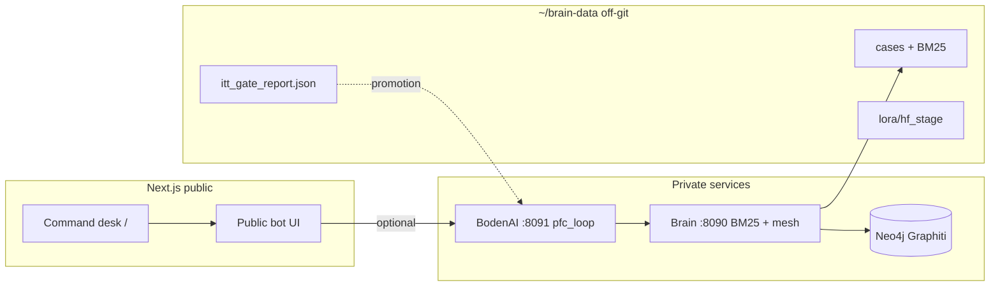

# Brain + Twin Remainder — Implementation Plan

## Summary

Finish the private brain warehouse (Graphiti mesh at scale), apply the automated ITT gate promotion (`pfc_loop`), stage optional LoRA training, and ship the public **command desk** homepage with a public-safe Boden bot — all hands-off/automated gates, no human ITT session.

## Problem Frame

P1–P7 offline pipeline, cognitive loop, mesh context, and automated ITT gate are landed. Remaining work spans **three surfaces**: (1) Neo4j mesh density for mesh-aware modes, (2) twin default mode + cloud train path, (3) public site integration via command desk + bot shell. Competing plans (`2026-07-23` cognitive loop, `2026-07-18` pipeline status) tracked execution but not the integrated finish line.

## Requirements

- **R1.** Graphiti bulk load reaches ≥200 episodic nodes in Neo4j with paced xAI ingest and resume from `load_state.json`.
- **R2.** `eval_itt_gate.py` runs in `run_pipeline.sh` and writes `eval/itt_gate_report.json` without human input.
- **R3.** Twin default decision mode follows gate recommendation (`pfc_loop` as of 2026-07-24) in `.env.example` and documented secrets sync.
- **R4.** Brain + BodenAI services expose health/config for promoted mode; mesh modes degrade gracefully when graph sparse.
- **R5.** LoRA assets remain staged at `lora/hf_stage/`; cloud GPU train is documented and runnable when credits/GPU available.
- **R6.** Command desk homepage (see origin `docs/plans/2026-07-07-001-feat-personality-grounded-home-hub-plan.md`) ships a vertical slice: desk scene + shortcuts + public-safe bot entry.
- **R7.** Public bot routes to BodenAI with synthesis-only responses — no raw private log exposure (covers AE3 from home hub plan).
- **R8.** Single authoritative remainder plan; prior cognitive-loop plan marked superseded.

## Key Technical Decisions

- **Automated ITT gate replaces human ranking as promotion gate:** `eval_itt_gate.py` (LLM + heuristic judge) → `eval_itt_score.py` logic; hands-off by policy (see `eval_itt_auto_rank.py`).
- **Promoted twin mode:** `BODENAI_DECISION_MODE=pfc_loop` until a future gate run beats it; `case_select` remains fallback on invalid mode.
- **Graphiti LLM provider:** xAI (`grok-3-fast`) for entity extract; Mistral for embeddings; pace with `--batch-size 10 --batch-delay 30 --max-batch-retries 4`.
- **Brain/twin default OFF in Next deploy:** Site works with flags unset; command desk bot calls local BodenAI when enabled.
- **Home hub deferred scope unchanged:** No raw archive browser, no WebGL room, no infra migration (see home hub plan Scope Boundaries).

## High-Level Technical Design

## Scope Boundaries

### In scope

- Graphiti paced bulk load to 200+ episodes
- Gate-driven mode promotion and pipeline integration
- LoRA staging + cloud train runbook
- Command desk vertical slice + bot wiring
- Living plan consolidation

### Deferred to Follow-Up Work

- PersonaForge P9 overlay authoring
- Eval4Sim full adoption
- HF dataset upload (`hf upload bolabaden/boden-sft`)
- Full 2.5D/WebGL desk, audio transcription public layer
- xfire video transcription backfill

### Outside scope

- Public dump of Discord/Xfire corpora
- LoRA training on local RX 460
- Cyberscape homepage revival

## Implementation Units

### U1. Finish Graphiti mesh load

**Goal:** Dense Neo4j graph for mesh-aware cognitive modes.

**Requirements:** R1, R4

**Dependencies:** None (export exists)

**Files:** `scripts/brain/load_graphiti.py`, `scripts/brain/graphiti_llm.py`, `services/brain/app/mesh.py`

**Approach:** Resume from `~/brain-data/graphiti/load_state.json` `offset_episodes`. Run paced xAI load until 200 episodes or export exhausted. Verify `/v1/mesh/context` returns entities for held-out probe tokens.

**Test scenarios:**
- Dry-run reports xAI provider and row counts.
- Resume after simulated batch failure continues from last offset.
- Mesh context returns `available: true` and non-empty `entity_names` for "minecraft mod" query when graph ≥200 episodic nodes.

**Verification:** `load_report.json` shows `episodes_loaded` ≥190 cumulative; Neo4j episodic count ≥200.

---

### U2. Wire automated ITT gate into promotion defaults

**Goal:** Hands-off gate drives twin config; no human ITT dependency.

**Requirements:** R2, R3

**Dependencies:** U1 optional (mesh improves pfc_loop but gate already ran)

**Files:** `scripts/brain/eval_itt_gate.py`, `scripts/brain/eval_itt_auto_rank.py`, `scripts/brain/run_pipeline.sh`, `.env.example`, `scripts/brain/sync_secrets.py`

**Approach:** Gate already implemented. Apply recommendation to secrets managed block: `BODENAI_DECISION_MODE=pfc_loop`. Re-run gate after Graphiti load completes to confirm mode still wins.

**Test scenarios:**
- `python eval_itt_gate.py --judge auto` exits 0 and writes `itt_gate_report.json`.
- `run_pipeline.sh` includes P7c gate step without prompting.
- BodenAI `/health` reports `decision_mode_default: pfc_loop` when env set.

**Verification:** `itt_gate_report.json` `promotion.recommended_mode` matches deployed env.

---

### U3. Service hardening (brain + BodenAI)

**Goal:** Reliable local stack for desk bot and eval reruns.

**Requirements:** R4

**Dependencies:** U1, U2

**Files:** `services/brain/docker-compose.brain.yml`, `services/bodenai/app/main.py`, `services/brain/app/main.py`, `AGENTS.md`

**Approach:** Document compose profiles (Neo4j + brain + bodenai). Ensure mesh sparse note in health when node count low. Compare API `/v1/decide/compare` smoke on one held-out stimulus.

**Test scenarios:**
- Brain `/health` with Neo4j down still serves BM25 search.
- BodenAI chat SSE includes `trace` event in `pfc_loop` mode.
- Mesh modes return case-only weights when `graph_sparse`.

**Verification:** Manual curl smoke documented in `scripts/brain/README.md`.

---

### U4. LoRA cloud train path

**Goal:** Runnable GPU train when operator has credits.

**Requirements:** R5

**Dependencies:** U2 (gate pass narrative)

**Files:** `scripts/brain/run_lora_hf.sh`, `scripts/brain/lora/train_qwen_lora.yaml`, `~/brain-data/lora/hf_stage/`

**Approach:** Stage assets (done). Operator runs LLaMA-Factory or HF Jobs on staged dir. Document HF 402 credit blocker and fallback providers.

**Test scenarios:**
- `./run_lora_hf.sh` copies sft + yaml to hf_stage.
- Train command documented; no local GPU assumption.

**Verification:** Staged directory contains `sft.jsonl`, `dataset_info.json`, `train_qwen_lora.yaml`.

---

### U5. Command desk homepage vertical slice

**Goal:** Replace generic homepage with command desk per home hub plan.

**Requirements:** R6, R7

**Dependencies:** U3 (bot backend optional)

**Files:** `src/app/page.tsx` (restore/replace), `src/components/` (desk scene), `public/home/`, `docs/plans/2026-07-07-001-feat-personality-grounded-home-hub-plan.md` (requirements source)

**Approach:** Implement first viewport + shortcuts (projects, guides, search, contact) + one repeat-visit artifact loop. Resolve Q1 phrase: **"Boden's command desk"** in public copy. Salvage or delete cabin components per Q2 during implementation.

**Test scenarios:**
- Covers AE1: no startup tagline hero copy on `/`.
- Covers AE2: first viewport reads as command desk not cozy cabin.
- Covers AE4: projects/contact reachable without exploring full scene.
- `npm run build` passes with brain/twin flags off.

**Verification:** Visual review + build green.

---

### U6. Public Boden bot shell

**Goal:** Desk guide bot calling BodenAI when enabled; public-safe synthesis.

**Requirements:** R7

**Dependencies:** U3, U5

**Files:** `src/app/api/boden/` or existing API routes, `services/bodenai/app/main.py`, `src/lib/config.ts`

**Approach:** Proxy chat to BodenAI when `BODENAI_ENABLED=true`. Enforce no raw archive in responses; route to pages on limit. Bot copy matches desk voice (R13–R15 home hub).

**Test scenarios:**
- Covers AE3: bot refuses to quote private Discord logs; offers public routes.
- BodenAI disabled → graceful stub on desk.
- SSE trace not exposed to public client (optional redaction).

**Verification:** Manual prompt test for archive-safety refusal.

---

### U7. PersonaForge overlays (deferred)

**Goal:** Manual correction layer post-twin stable.

**Requirements:** Deferred

**Dependencies:** U2, U5

**Verification:** Track only in pipeline status; no implementation this phase.

**Scoped (not implemented) 2026-07-30:** [`docs/brainstorms/2026-07-30-personaforge-overlays-requirements.md`](../brainstorms/2026-07-30-personaforge-overlays-requirements.md) — requirements doc for a future `ce-plan` pass, written now that U2/U5's preconditions are met. Still explicitly no implementation this phase.

---

## Sequencing

| Order | Unit | Status (2026-07-30) |
|-------|------|---------------------|
| 1 | U1 Graphiti finish | **verified done** — 513 episodic nodes persisted, ≥200 threshold met, mesh_context confirmed live |
| 2 | U2 Gate + promotion | **done** — port + decision-mode wiring fixed end-to-end (config.ts, Dockerfile, compose, README) |
| 3 | U3 Service hardening | **done** — full smoke pass verified; found + fixed a real health-check timeout bug |
| 4 | U4 LoRA cloud | staged, operator (unchanged — needs GPU/HF credits) |
| 5 | U5 Command desk | **done** — homepage restored, GitHub Pages export fixed |
| 6 | U6 Public bot | **frontend done** — disabled-by-default UX + live path implemented; trace redaction deferred |
| 7 | U7 PersonaForge | deferred (unchanged) |

## Risks

| Risk | Mitigation |
|------|------------|
| xAI 429 during Graphiti | batch delay + retries; resume offset |
| Automated ITT judge ≠ human taste | re-gate after mesh load; keep case_select fallback |
| HF credits depleted | document; Mistral/xAI for inference only |
| Home hub scope creep | vertical slice only; defer WebGL/archive browser |

## Sources

- `docs/plans/2026-07-18-bodenai-pipeline-status.md`
- `docs/plans/2026-07-23-cognitive-loop-experimental-brain-plan.md`
- `docs/plans/2026-07-07-001-feat-personality-grounded-home-hub-plan.md`
- `~/brain-data/eval/itt_gate_report.json`
- `scripts/brain/README.md`

---

### Delta Update (2026-07-24)

- **Landed:** Automated ITT gate (`eval_itt_gate.py`), `pfc_loop` promotion, cognitive loop + mesh endpoint, LoRA staging, paced Graphiti loader hardening.
- **Partial:** Graphiti bulk (~463/200+ episodic nodes, load running); secrets/env promotion not yet synced to live `.env`; command desk not started.
- **Next:** Complete U1 → sync `BODENAI_DECISION_MODE` → U5 desk slice → U6 bot shell → U4 when GPU available.

### Delta Update (2026-07-30)

- **Landed:**
  - **U5** — homepage fully restored (was deleted with only a static rewrite standing in). Ported into `src/app/page.tsx` as config-driven React sections (proof ledger, archive-boundary, rotating desk-artifact repeat-visit card), retired `public/home/*` + the `next.config.ts` rewrite. Also fixed the GitHub Pages static-export build, which had never actually completed (missing `generateStaticParams`/`revalidate` on dynamic/metadata routes, a real Satori JSX-children bug, `/search` reading `searchParams` server-side). Verified in an isolated worktree: `DEPLOY_TARGET=github-pages npm run build` exits 0.
  - **U6 (frontend half)** — `BodenDeskBot` component wired to the existing `/api/boden/chat` route; shows a public-safe "not wired up yet" message when `BODENAI_UI_PUBLIC` is off (the default), matching the U3 test scenario. Live-chat path is implemented but unverified against a running twin beyond the smoke test below.
  - **U2** — `BODENAI_BASE_URL` code default was `8080`, contradicting `.env.example`'s documented `8091`; fixed in `src/lib/config.ts`. Traced further: `services/bodenai`'s own Dockerfile/compose/README were *also* still on 8080 end-to-end (the port was never actually 8091 anywhere in the running stack) — aligned all of them to 8091 and added the missing `BODENAI_DECISION_MODE` passthrough to `docker-compose.bodenai.yml` (defaults to `pfc_loop`; was never wired into the container environment at all before this).
  - **U1 verification** — started Neo4j + `services/brain` locally against the existing `brain_brain_neo4j` docker volume (no new xAI spend). Found **513 episodic nodes already persisted** (`load_state.json`'s `offset_episodes: 20` is stale bookkeeping, not the real count). `POST /v1/mesh/context {"query":"minecraft mod"}` returns `available: true` with real entity names (`Ultimate Saber Mod`, `Schematic Lightsaber Mod`, `KOTORModSync`) and `node_count: 614`. **R1 (≥200 episodic nodes) is met** — did not run a new paced load since the threshold is already cleared; re-running `eval_itt_gate.py` was skipped this pass (real LLM-judge spend) since nothing about the graph changed.
  - **U3 full smoke pass** — all four checklist items verified live: brain `/health` + `/v1/mesh/context`; BodenAI `/health` (`decision_mode_default: pfc_loop` confirmed) + `POST /v1/decide/compare` (all four modes respond correctly); BM25 search confirmed still works with Neo4j stopped (`available: false` on mesh, search itself unaffected); chat SSE confirmed emits a `trace` event with `"decision_mode": "pfc_loop"`.
  - **Real bug found + fixed during U3 smoke:** brain's `/health` unconditionally ran live probes against all 9 configured LLM providers on every call — **41s response time**, well past the `docker-compose.brain.yml` healthcheck's 5s timeout (would have permanently reported unhealthy under real orchestration) and past BodenAI's own 5s timeout for checking brain's health (BodenAI's `/health` was reporting `ok: false` because of this, not because of any real problem). Made the live probing opt-in via `GET /health?probe=true` (`graphiti_llm.provider_status(probe=...)`, `retrieve.graphiti_status(probe=...)`); default `/health` now responds in ~2.5s. Deep probe path verified still works when requested.
  - **Hygiene:** `__pycache__/*.pyc` was tracked in git (17 files, never gitignored) — untracked and added to `.gitignore`.
- **Partial:** U6 disabled-by-default state and archive-safety copy done; SSE `trace` redaction for public exposure not implemented (deferred — no evidence it's needed yet, current UI keeps `BODENAI_UI_PUBLIC` off by default).
- **Not attempted:** U4 (LoRA cloud train — operator action, needs GPU/HF credits, `hf_stage/` already staged from prior session, nothing new to verify without spending); U7 (explicitly deferred, no implementation this phase); a fresh paced Graphiti load beyond the 200-node threshold (R1 already satisfied; further loading is a judgment call on marginal mesh-density value vs. xAI spend, not a correctness gap).
- **Next:** If deeper mesh density is wanted, resume the paced load from the real Neo4j-persisted state (not `load_state.json`'s stale offset) with an explicit go-ahead given the xAI cost. Otherwise this remainder plan's non-operator, non-deferred scope is complete.
