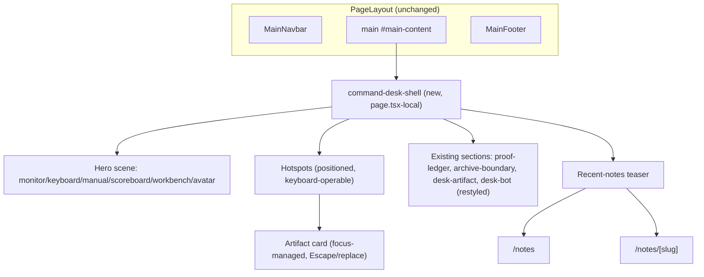
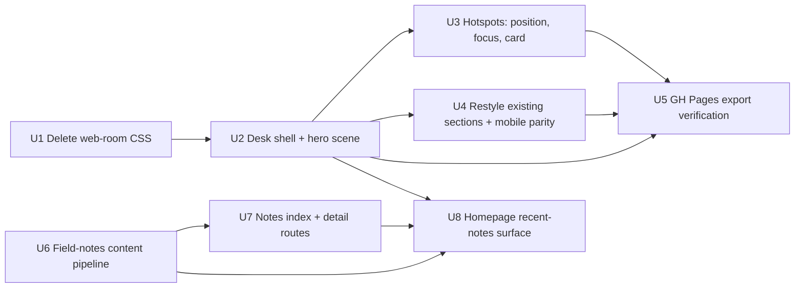

# Command Desk Activation

## Summary

Wire the unreferenced `.command-desk-*` CSS into the homepage as a scene the homepage's own content wraps locally, add hotspot interaction with real focus management, extend a required-approver field to hotspot and note content, and stand up an independent field-notes content pipeline with its own listing and detail routes.

## Problem Frame

The homepage renders config-driven React sections in generic Tailwind utilities while `src/app/globals.css` carries a complete, never-referenced "command desk" design system (see origin). Repo research confirmed the stylesheet's three real gaps — no hotspot positioning, no focus styling anywhere in the block, never rendered against real markup — and surfaced five plan-time decisions the origin brainstorm never saw: `PageLayout` has no extension seam, the field-notes teaser has no page to link to, the notes CSS widget is a tab switcher rather than a list, the artifact-approval requirement has no enforcement mechanism today, and the GitHub Pages CI strips `force-dynamic` via an exact string match new routes must reproduce.

## Key Technical Decisions

- **The desk shell wraps homepage content locally, not `PageLayout`.** `src/components/page-layout.tsx` accepts only `{ children }` and is shared by six other routes. Rather than adding a variant prop (which would need a default-off state verified across every call site), `src/app/page.tsx` wraps its own returned content in the shell. `MainNavbar`/`MainFooter` render as `PageLayout` siblings outside that wrapper, so the shell's `--desk-*` custom properties and `color: var(--desk-ink)` never cascade into them, and no other route changes at all.
- **Hotspot placement is delivered as per-hotspot CSS classes, not custom properties.** `eslint.config.mjs` bans the `style` JSX attribute outright — including `style={{ '--x': ... }}` — so positioning cannot be set via inline custom properties. New modifier classes follow the same percentage-coordinate pattern already used by the scene's other absolutely-positioned children.
- **Field notes get an independent content loader, not `getGuides()`.** `src/lib/guides.ts` has no `date` field (dates come from filesystem `stat()`) and no concept of an approver. Notes need both as first-class frontmatter, plus different sort order and no difficulty rating — different enough to warrant a parallel loader over extending the shared one.
- **Hotspot artifacts require an approver field on every entry; field notes require it only when derived from the private corpus.** Today `HOME_DESK_ARTIFACTS` in `src/lib/config.ts` can be edited via `NEXT_PUBLIC_HOME_DESK_ARTIFACTS_JSON` at deploy time with no review trail — every hotspot artifact is treated as a "reveal" worth gating. Field notes are different: R18's actual gate only applies to private-corpus-derived content, so making `approvedBy` mandatory on every note (an earlier draft of this plan did) would add authoring friction to routine public posts without origin's authorization. `DeskArtifact` gets a required, non-blank `approvedBy: string`; `FieldNoteFrontmatter` gets an optional `approvedBy` required only when a `derivedFromPrivateCorpus` (or similarly named) flag is set. Neither check reaches content supplied via `NEXT_PUBLIC_HOME_DESK_ARTIFACTS_JSON` at deploy time — that env-var path parses with no per-element schema validation and bypasses the type-level guarantee entirely; see Risks & Dependencies.
- **The notes list gets new markup and CSS, not the existing `.command-desk-notes` widget.** That block implements a tabs-plus-single-active-article switcher; "recent notes" needs a scannable list. New markup reuses the generic `.command-desk-shortcut`/`.command-desk-section` card tokens already shared by other desk surfaces. `.command-desk-notes` stays in the stylesheet unused — flagged under Scope Boundaries rather than deleted now.
- **New note routes mirror `src/app/guides/[slug]/page.tsx` exactly, including its `force-dynamic` literal.** `.github/workflows/deploy-pages.yml` strips `export const dynamic = "force-dynamic";` by an exact string match before the static-export build, then relies on `generateStaticParams` to enumerate pages. A differently-worded dynamic export would build locally and fail only in that CI job.
- **`.web-room-*` is deleted, not ported.** Confirmed zero references anywhere in `src/`; it's the superseded system the origin document's own key decision calls out for removal alongside activation.

## Requirements

Carried forward from origin (see `docs/brainstorms/2026-07-30-command-desk-activation-requirements.md`); R-IDs match exactly and are not repeated here except where this plan adds to them.

**Homepage command desk:** R1–R12 (shell, scene, first-viewport shortcuts, hotspot content/approval/positioning, existing-section restyling, mobile parity, keyboard/focus/lifecycle).

**Discovery hub consistency:** R13 (GitHub Pages export correction).

**Field notes:** R14–R19 (surface, metadata, markdown storage, homepage teaser, private-corpus gate, staleness fallback).

**New in this plan:**

- R20. (Plan-introduced, not in origin.) The field-notes surface must include a listing page and individual note pages, not only the homepage teaser — origin's R15 requires each note be independently indexable but doesn't specify a listing page; without one, published notes become unreachable once they scroll off the homepage's recent window.
- R21. Hotspot artifact content must carry a required approver field, checked at the type level. Field-note content must carry the same field, required only on notes flagged as derived from the private corpus (per R18) — routine public notes are not gated behind an approver.

## High-Level Technical Design

Unit dependency order:

`U6`/`U7`/`U8` (field notes) have no dependency on `U1`–`U5` (desk scene) beyond `U8` needing the shell to exist; the two groups can proceed in parallel after `U2`.

---

## Implementation Units

### U1. Delete the superseded `.web-room-*` stylesheet

**Goal:** Remove the second orphaned design system from `src/app/globals.css` before other edits touch the same file.

**Requirements:** None (implements Key Technical Decision: delete `.web-room-*` stylesheet)

**Dependencies:** None

**Files:**
- `src/app/globals.css` — delete the `.web-room-*` rule block. Confirm the exact range with `grep -n "web-room" src/app/globals.css` at implementation time rather than trusting a cited line range — the block runs through its trailing `@media` query and `@keyframes` rules (`web-room-pulse`, `web-room-firefly`), past where an earlier read of this plan estimated it ending.

**Approach:** Confirm zero references first (`grep -rn "web-room" src`), then delete the full block — including its media queries and keyframes, not just the base selectors — in one pass. No markup or component changes — nothing in `src/` uses these classes.

**Test scenarios:**
- Test expectation: none — pure CSS deletion with no behavioral surface; `npm run build` and `npm run lint` are the verification.

**Verification:** `npm run build` and `npm run lint` both pass; no visual change on any route (the deleted rules were unreferenced).

---

### U2. Homepage desk shell and hero scene

**Goal:** Wrap the homepage's own content in `command-desk-shell` and build the hero scene markup against the stylesheet's existing scene-child classes, satisfying R1–R3.

**Requirements:** R1, R2, R3

**Dependencies:** U1

**Files:**
- `src/app/page.tsx` — wrap the page's returned JSX in a `command-desk-shell` container; compose the hero scene inside it
- `src/components/desk-scene.tsx` (new) — the scene markup (monitor, keyboard, manual, scoreboard, workbench, sticky notes, avatar), each mapped to its documented `.command-desk-scene__*` class and expected child elements
- Existing `DiscoveryPageHero` shortcut links (projects / guides / portfolio) — restyle in place with desk tokens rather than replacing; this is what satisfies R3's "directly clickable, not hotspot-gated" requirement

**Approach:** The shell wraps content that already renders inside `PageLayout`'s `<main>`, so `MainNavbar`/`MainFooter` sit outside it in the DOM and never inherit `--desk-ink` or the shell's custom properties. `command-desk-shell` has `min-height: 100vh` but no explicit `height`, so normal-flow content taller than one viewport is not clipped by its `overflow: hidden` — verified directly against the stylesheet. Build each scene child against its documented expected structure (e.g. `.command-desk-scene__scoreboard` expects ``/`<small>`/`<strong>` children) rather than guessing markup shape.

**Patterns to follow:** `src/lib/config.ts`'s `buildConfiguredSections` / `HOME_LAYOUT_SECTIONS` pattern for how `page.tsx` composes sections — the shell wraps the existing composition, it doesn't replace it.

**Test scenarios:**
- Test expectation: none — this unit is markup/CSS composition with no pure-function surface; verified visually and via build, per this project's own test-scope convention (`src/lib/*.ts` pure functions only).

**Verification:** Render the homepage at 1440px, 900px, and 375px in at least two browser engines (e.g. Chromium and Safari/WebKit) in the dev server — the scene uses `perspective`/`rotateX` transforms and `mask-image` gradients with no `-webkit-` fallback, properties with known cross-engine rendering variance. Confirm: the HUD grid, gradient field, and desk-ink palette are visible; the scene composes without obviously broken layout in either engine; navbar and footer text keep their existing colors (not desk-ink); `npm run build` and `npm run lint` pass. This is the go/no-go checkpoint the origin document's stylesheet-readiness assumption depends on — if scene composition breaks down at a viewport or in one engine, resolve it here before U3/U4 build on top.

---

### U3. Hotspots: positioning, focus management, artifact card lifecycle

**Goal:** Make scene hotspots keyboard-operable controls that open an approved artifact card with correct focus handling, satisfying R4–R6, R10–R12, R21 (hotspot half).

**Requirements:** R4, R5, R6, R10, R11, R12, R21

**Dependencies:** U2

**Files:**
- `src/app/globals.css` — new per-hotspot modifier classes (e.g. one class per hotspot position, following the sibling scene-children's percentage-coordinate pattern); explicit `:focus-visible` rules (an outline in `--desk-cyan` or `--desk-amber`, visible against the scene's dark background) for the hotspot button, its close control, and the artifact card — the block being wired in has zero focus styling today, one of the three gaps this plan exists to close, and the superseded `.web-room-*` system being deleted in U1 had two `:focus-visible` rules this replacement must not regress from; a padding-based touch-target increase to at least 44×44px on the hotspot button at the 640px breakpoint, since the visible label hides there and the orb glyph alone (2.35rem) is a borderline mobile target
- `src/components/desk-hotspot.tsx` (new) — hotspot button: `useId()` for a stable id, `aria-expanded`/`aria-controls` wired to the artifact card, accessible name independent of the visually-hidden label
- `src/components/desk-artifact-card.tsx` (new) — the artifact card: explicit close control, Escape-key dismissal, `useRef` + `.focus()` to move focus in on open and return it to the originating hotspot on close
- `src/app/page.tsx` or `desk-scene.tsx` — single `activeHotspotId: string | null` state at the parent level so activating a new hotspot replaces rather than stacks the open card
- `src/lib/config.ts` — `DeskArtifact` type gains a required `approvedBy: string` field; existing `HOME_DESK_ARTIFACTS` entries updated with a non-empty value or the build fails on the type error

**Approach:** Mirror `src/components/about-guides-section.tsx`'s `FeatureCard` for the `useId()` + `aria-expanded`/`aria-controls` disclosure wiring — the closest existing precedent — then extend it with the focus-in/focus-return behavior that pattern doesn't currently have anywhere in this codebase. Public-safe content (R4): synthesized or paraphrased only, no verbatim quotes, usernames, or IDs from the private corpus; `approvedBy` is the enforcement mechanism, not a style guideline alone.

**Patterns to follow:** `src/components/about-guides-section.tsx` (disclosure wiring), `src/components/main-navbar.tsx` / `about-navigation.tsx` (existing `useId()`-based `aria-controls` usage).

**Execution note:** Build the focus-management behavior test-first at the component level if this project's test conventions are extended to cover it; otherwise verify manually per the Verification field below — no existing precedent in this codebase does programmatic focus-in/focus-return today, so treat it as new, unverified-by-pattern behavior worth deliberate manual QA.

**Test scenarios:**
- Happy path: activating a hotspot via mouse click opens its artifact card with the correct content.
- Keyboard: tabbing to a hotspot and pressing Enter/Space opens the card; focus moves into the card or its close control.
- Dismissal: pressing Escape closes the card and returns focus to the originating hotspot; clicking the explicit close control does the same.
- Replace-not-stack: activating a second hotspot while a card is open closes the first and opens the second, never both.
- Approval gate: a `DeskArtifact` entry missing `approvedBy`, or with an empty/whitespace-only value, fails the build — a required `string` type alone only catches absence, not a placeholder value like `""`, so the check must reject blank strings explicitly, not just missing keys.
- Test expectation for the CSS/markup pieces specifically: none beyond the above interaction scenarios — no DOM-level unit test infra in this project; verify manually in the dev server per each scenario, including that the new `:focus-visible` outline is actually visible against the scene background at each viewport.

**Verification:** All five interaction scenarios pass manual keyboard-only and mouse walkthroughs in the dev server; `npm run build` fails if any `HOME_DESK_ARTIFACTS` entry lacks `approvedBy` or has a blank value; `npm run lint` passes (confirms no inline `style` was introduced for positioning); focus is visibly indicated on the hotspot, its close control, and the card at all three viewports.

---

### U4. Restyle existing sections and fix mobile content parity

**Goal:** Apply desk styling to the proof-ledger, archive-boundary, desk-artifact, and desk-bot sections without changing their content or config keys, and ensure scoreboard/manual/sticky content stays reachable on mobile, satisfying R7–R9.

**Requirements:** R7, R8, R9

**Dependencies:** U2. (No longer depends on U3 — mobile parity uses its own always-visible summary block rather than U3's hotspot artifact card; see Approach.)

**Files:**
- `src/components/proof-ledger-section.tsx`, `src/components/archive-boundary-section.tsx`, `src/components/desk-artifact-section.tsx`, `src/components/boden-desk-bot.tsx` — swap generic Tailwind utility classes (`border-[#1f1f1f]`, `text-zinc-500`, emerald accents) for the corresponding `.command-desk-section`, `.command-desk-section-heading`, `.command-desk-signal`/`.command-desk-shortcut`/`.command-desk-artifact` card classes
- `src/components/desk-scene.tsx` — a dedicated, always-visible mobile summary block (new markup, own CSS) surfacing scoreboard/manual/sticky content below the scene at the 640px breakpoint, replacing those elements' `display: none`-hidden content rather than duplicating it into a hotspot artifact card

**Approach:** Content and `HOME_LAYOUT_SECTIONS`/config keys are unchanged — this is a styling-only pass per R7's own constraint, verified by AE3. `boden-desk-bot.tsx`'s existing `DeskBotChat` already has some focus-related classes; map it onto `.command-desk-bot`/`__bar`/`__input`/`__answer` directly. Mobile parity uses an always-visible summary, not a hotspot artifact card: hotspot cards are gated behind an interaction and inherit R4/R21's approval requirement, but scoreboard/manual/sticky content is decorative scene furniture, not an approved "reveal" — routing it through the hotspot mechanism would conflate two different content categories and force an unnecessary approval question. Any content moved into this summary block must still stay within R4's public-safe constraint even though it isn't a hotspot artifact, and must not reintroduce the horizontal overflow AE2 requires the 375px viewport to avoid.

**Patterns to follow:** `.command-desk-section`/`.command-desk-section-heading` as the generic wrapper (confirmed reusable across signal/shortcut/artifact/source card variants).

**Test scenarios:**
- AE3 (from origin): given the proof ledger section, when desk styling is applied, then its content and configuration keys are unchanged.
- AE2 (from origin): given a 375px-wide viewport, when the homepage loads, then the scene renders without horizontal overflow and the hidden elements stay hidden.
- Mobile content parity: given a 375px viewport, when a visitor looks for scoreboard/manual/sticky content, then it is reachable via the always-visible summary block, not silently absent.
- No overflow regression: given the new summary block renders at 375px, when checked against AE2, then the page still has no horizontal overflow.
- Test expectation: none beyond the above — verified manually at 375px/900px/1440px per this project's test-scope convention.

**Verification:** Visual diff at three viewports confirms restyled sections keep their content; `npm run lint`/`npm run build` pass; manually confirm scoreboard/manual/sticky content is reachable via the summary block on a 375px viewport with no horizontal overflow.

---

### U5. GitHub Pages export verification

**Goal:** Confirm the static export still builds clean with the desk homepage and satisfy R13's corrected understanding of how API stripping works.

**Requirements:** R13

**Dependencies:** U2, U3, U4

**Files:** None expected — this unit is verification, not new code, unless the desk homepage introduced a server-only dependency incompatible with static export, in which case fix it here.

**Approach:** `.github/workflows/deploy-pages.yml` strips `src/app/api` and any literal `export const dynamic = "force-dynamic";` line before running `DEPLOY_TARGET=github-pages npm run build`. Reproduce that locally (remove `src/app/api`, run the build with the env var set) rather than trusting `next.config.ts` alone, since it doesn't perform the stripping itself.

**Test scenarios:**
- Test expectation: none — this is a build-verification unit, not new behavior; the check itself is the test.

**Verification:** With `src/app/api` removed and `DEPLOY_TARGET=github-pages` set, `npm run build` exits zero and the homepage renders without any server-only route dependency (AE4, corrected).

---

### U6. Field-notes content pipeline

**Goal:** Stand up an independent markdown content pipeline for field notes with a mandatory `date` field and a conditionally-required `approvedBy` field, satisfying R14, R16, R18, R21 (notes half).

**Requirements:** R14, R16, R18, R21

**Dependencies:** None (parallel to U1–U5)

**Files:**
- `src/content/field-notes/` (new directory) — markdown source files
- `src/lib/field-notes.ts` (new) — loader mirroring `src/lib/guides.ts`'s structure: `server-only` import, `cache()`-wrapped reads, frontmatter parsing; adds a required `date` field (neither exists in the guides parser today) and validates `approvedBy` is present and non-blank whenever `derivedFromPrivateCorpus` is true
- `src/lib/types.ts` — new `FieldNote`/`FieldNoteFrontmatter` types (`date: string` required; `derivedFromPrivateCorpus?: boolean`; `approvedBy?: string`, required only when that flag is set)
- `next.config.ts` — add `./src/content/field-notes/**/*.md` to `outputFileTracingIncludes` alongside the existing guides globs, so the standalone build doesn't silently omit notes

**Approach:** Parallel structure to `guides.ts`, not a shared loader — different sort order (by `date`, not filename) and no `difficulty` concept. R18's private-corpus gate applies only to notes flagged as private-corpus-derived, matching origin's own conditional language, not a blanket requirement on every note. A note missing `date`, or flagged private-corpus-derived with a missing or blank `approvedBy`, should fail the loader (or `npm run build`) rather than render with fallback values that mask the gap.

**Patterns to follow:** `src/lib/guides.ts` for the `server-only` + `cache()` + frontmatter-parsing shape; `src/lib/guides.ts`'s `parseFrontmatter` for the hand-rolled frontmatter format (no third-party dependency to add).

**Test scenarios:**
- Happy path: a note with valid frontmatter (`date`, `description`) and no private-corpus flag loads and parses correctly with no `approvedBy` required.
- Edge case: a note missing `date` fails loudly (build error or thrown validation), not silently.
- Edge case: a note with `derivedFromPrivateCorpus: true` and a missing or blank `approvedBy` fails loudly.
- Edge case: a note with `derivedFromPrivateCorpus: true` and a valid `approvedBy` loads correctly.
- Edge case: an empty `src/content/field-notes/` directory returns an empty list, not an error.
- Sorting: notes sort by `date` descending, most recent first.

**Verification:** `src/lib/field-notes.test.ts` covers the scenarios above as pure-function tests (matching this project's existing test-scope convention for `src/lib/*.ts`); `npm run build` succeeds with the new `outputFileTracingIncludes` entry present.

---

### U7. Notes index and detail routes

**Goal:** Give published notes a real, indexable destination — a listing page and individual note pages — satisfying R15, R20, and the static-export half of R13's pattern.

**Requirements:** R15, R20

**Dependencies:** U6

**Files:**
- `src/app/notes/page.tsx` (new) — listing page, mirroring `src/app/guides/page.tsx`'s structure
- `src/app/notes/[slug]/page.tsx` (new) — detail page, mirroring `src/app/guides/[slug]/page.tsx`'s structure exactly, including its literal `export const dynamic = "force-dynamic";` line and its `generateStaticParams` implementation, sourced from `field-notes.ts` rather than `guides.ts`
- `src/app/sitemap.ts` — add notes to the sitemap the same way guides are already included

**Approach:** The `force-dynamic` literal must match exactly what `.github/workflows/deploy-pages.yml`'s regex-based strip step expects (confirmed at that file's line ~34) — copying `guides/[slug]/page.tsx`'s pattern verbatim is lower-risk than writing an equivalent from scratch. Empty-state and single-note-state on the index page need their own handling, since R20's index page is new scope AE5/AE8 (which cover the homepage teaser only) don't reach.

**Patterns to follow:** `src/app/guides/page.tsx`, `src/app/guides/[slug]/page.tsx` (route structure, `generateStaticParams`, `force-dynamic` handling), `src/app/sitemap.ts` (existing guides inclusion).

**Test scenarios:**
- Zero notes: the index page renders an empty-state message rather than erroring.
- One note: the index page lists it and links to a working detail page.
- Static export: `DEPLOY_TARGET=github-pages npm run build` succeeds with the notes routes present.
- Test expectation: index/detail page rendering itself follows this project's convention of manual/build verification rather than component-level unit tests; any pure sorting/formatting logic extracted for these pages is covered under U6's test file instead.

**Verification:** `npm run build` and the GitHub Pages export both succeed; manually confirm the index page and a detail page render correctly with zero, one, and multiple notes present.

---

### U8. Homepage recent-notes surface

**Goal:** Surface recent notes on the homepage with a staleness fallback, satisfying R17 and R19.

**Requirements:** R17, R19

**Dependencies:** U2 (shell), U6 (loader), U7 (link target)

**Files:**
- `src/components/desk-notes-section.tsx` (new) — recent-notes list: each row is a single full-row link to `/notes/[slug]` (not a title-only link) showing the note's title and formatted date, no excerpt (keeps the list scannable per its own goal), a fixed max item count, a line-clamp/truncation rule for long titles, and a visible `:focus-visible` state on each row — new CSS mirroring `desk-artifact-section.tsx`'s card-as-link precedent, not the `.command-desk-shortcut` grid tile (that token is a square icon+label+snippet tile sized for a 3-up shortcut grid, not a repeatable list row)
- `src/lib/config.ts` — add a `field-notes` (or similarly named) entry to the `HomeLayoutSectionId` union type
- `src/app/page.tsx` — add the corresponding entries to the locally-defined `VALID_HOME_SECTION_ID_SET` and `HOME_LABEL_FALLBACKS` constants (both defined in this file, not `config.ts`), plus the corresponding `case` in `renderHomeSection`
- A pure staleness-check helper (e.g. `isNotesFeedStale(newestNoteDate, thresholdDays)`), colocated with `desk-notes-section.tsx` and exported for testing, mirroring `desk-artifact-section.tsx`'s `pickDailyArtifact` pattern

**Approach:** `.command-desk-notes` isn't reused (see Key Technical Decisions) — it stays in the stylesheet unused rather than being deleted in this unit, to avoid scope creep beyond what's needed. The staleness threshold is a configurable constant, not hardcoded inline, so it's adjustable without a code change to the comparison logic itself.

**Patterns to follow:** `src/components/desk-artifact-section.tsx` / `desk-artifact-section.test.ts` for the pure-helper-plus-component split and its test convention; `src/lib/config.ts`'s `buildConfiguredSections` pattern for wiring in a new home section id.

**Test scenarios:**
- Covers AE5 (origin). Given no notes have been written yet, when the homepage renders, then the notes area is hidden or shows a resting state rather than an empty shell.
- Covers AE8 (origin). Given the newest note is older than the configured threshold, when the homepage renders, then the notes area shows the resting state rather than a dated entry.
- Happy path: given one or more notes newer than the threshold, when the homepage renders, then the most recent notes are listed with working links to `/notes/[slug]`.
- Boundary: a note exactly at the staleness threshold is treated as not-stale (inclusive boundary), tested directly on `isNotesFeedStale`.

**Verification:** `src/components/desk-notes-section.test.ts` covers the staleness helper's scenarios above as pure-function tests; manual verification in the dev server for the zero/fresh/stale rendering states; `npm run build` and `npm run lint` pass.

---

## Scope Boundaries

Carried forward from origin: `/about` untouched; PR #4 (`feat/cyberscape-hold`) stays parked; no raw private-corpus material ships in any form; no git history rewrite; no database or authentication layer; extending desk tokens to `/projects`, `/guides`, `/dashboard`, `/contact`, `/search`, and 404 is a separate later pass; curated personal stories and repeat-visit-loop analytics tuning stay deferred.

### Deferred to Follow-Up Work

- The repo-hygiene work (commit trailers, untracking config/planning docs) lives in `docs/brainstorms/2026-07-30-repo-hygiene-requirements.md` and is out of scope here.
- `.command-desk-notes` (the tabs-oriented CSS widget superseded by U8's new list markup) is left in the stylesheet unused rather than deleted in this pass — a future cleanup pass should remove it alongside any other CSS this activation leaves unreferenced.
- `AGENTS.md`/`CLAUDE.md`'s slightly imprecise claim that `next.config.ts` strips `src/app/api` for GitHub Pages (it's actually `.github/workflows/deploy-pages.yml`) is a small doc-accuracy fix outside this plan's scope; worth a follow-up note.

## Risks & Dependencies

- **The desk stylesheet has never been rendered against real markup.** U2's three-viewport verification is the go/no-go checkpoint; if scene composition breaks down there, U3–U5 depend on resolving it first before proceeding.
- **`DeskArtifact`'s new required `approvedBy` field is a breaking type change.** Every existing entry in `HOME_DESK_ARTIFACTS` (`src/lib/config.ts`) needs a non-blank value added in the same commit as the type change, or the build fails — expected and desired (that's the enforcement mechanism), but worth flagging so it isn't mistaken for an unrelated build break.
- **The `approvedBy` type check does not cover the `NEXT_PUBLIC_HOME_DESK_ARTIFACTS_JSON` override path.** `envJson()` in `src/lib/config.ts` does a bare `JSON.parse` plus an array-shape check, with no per-element schema validation — an artifact array supplied via that environment variable at deploy time can omit `approvedBy` entirely and render at runtime, bypassing R21's compile-time guarantee. This is the exact failure mode R21 exists to close, left open for the one path that isn't reviewed in git. Runtime validation of env-sourced artifacts is not scheduled in any unit above; treat closing this gap as follow-up work, not a false sense of completeness from this plan alone.
- **The GitHub Pages CI's `force-dynamic` strip is a literal string match, not a build-flag check.** New note routes must reproduce `guides/[slug]/page.tsx`'s exact line, or the export build passes locally and fails only in that CI job.

## Open Questions

### Deferred to implementation

- Which hotspots anchor the first release, and what artifact does each reveal? This is a content-authoring decision — the mechanism (U3) is generic and supports any number of approved hotspots; the actual picks depend on the operator's own material, not a technical unknown.
- Full desk-token extension to secondary routes (deferred per Scope Boundaries) will need its own follow-up plan once this lands.
- Should `envJson`-sourced content (the `NEXT_PUBLIC_HOME_DESK_ARTIFACTS_JSON` override) get its own runtime schema validation so the `approvedBy` guarantee holds for that path too, and if so, in a follow-up unit or this plan's own scope?

## Sources / Research

- `docs/brainstorms/2026-07-30-command-desk-activation-requirements.md` — origin document; R1–R19, AE1–AE8.
- `src/app/globals.css` lines 2078–2849 (`.command-desk-*`, catalogued per selector family) and 285–1363 (`.web-room-*`, confirmed zero references).
- `src/components/page-layout.tsx` — confirmed no extension seam exists today; motivates the local-wrap decision over a shared-shell prop.
- `src/lib/guides.ts`, `src/lib/types.ts`, `src/app/guides/page.tsx`, `src/app/guides/[slug]/page.tsx` — the pattern U6/U7 mirror, including the `force-dynamic` + `generateStaticParams` shape.
- `.github/workflows/deploy-pages.yml` line ~34 — the exact mechanism that strips `src/app/api` and `force-dynamic` exports for the static export build.
- `next.config.ts` — `outputFileTracingIncludes` current scope (`src/content/guides/**/*.md`, `guides/**/*.md`), relevant to U6.
- `eslint.config.mjs` lines 31–39 — the inline-`style` ban that shapes U3's positioning approach.
- `src/components/about-guides-section.tsx`, `main-navbar.tsx`, `about-navigation.tsx` — existing `useId()`/`aria-expanded`/`aria-controls` disclosure precedent for U3.
- `src/components/desk-artifact-section.tsx` / `.test.ts` — the pure-helper-plus-component test pattern U8 follows.
